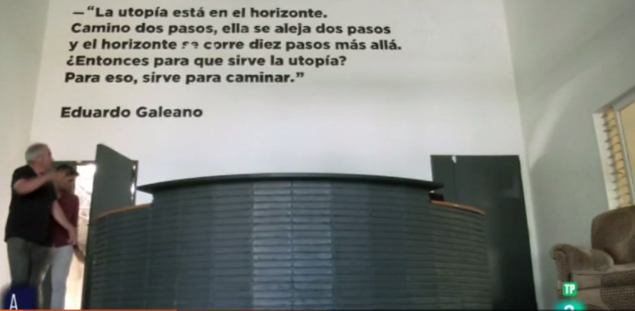
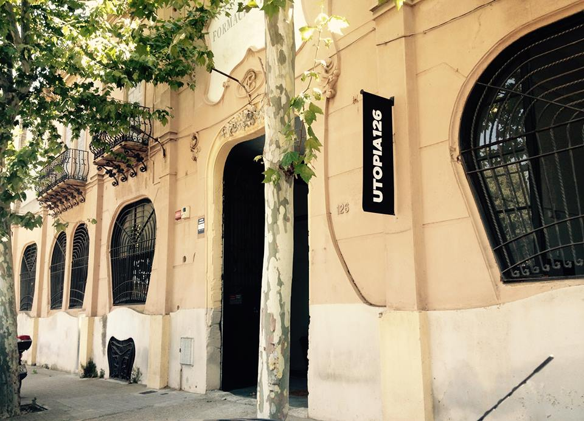

<a href="https://about.me/inafev">about.me</a>

# Awesome Tech

- A curated list of awesome IT projects and resources collected since 2014. Inspired by the [awesome](https://github.com/sindresorhus/awesome) list.

# Inspired by
- [getAwesomeness](https://getawesomeness.herokuapp.com/)
- [Awesome AWS](https://github.com/donnemartin/awesome-aws)
- [Awesome sysadmin](https://github.com/kahun/awesome-sysadmin)
- [Awesome security](https://github.com/sbilly/awesome-security)
    - [Awesome security talks](https://github.com/PaulSec/awesome-sec-talks)
    - [Awesome penetration testing](https://github.com/enaqx/awesome-pentest)
    - [Awesome android security](https://github.com/ashishb/android-security-awesome)
    - [Awesome Windows Exploitation](https://github.com/enddo/awesome-windows-exploitation)
- [Awesome docker](https://github.com/veggiemonk/awesome-docker)
- [Awesome big data](https://github.com/onurakpolat/awesome-bigdata)
- [Awesome OpenStack](http://ramitsurana.github.io/awesome-openstack/)
- [Awesome Puppet](https://github.com/olindata/awesome-puppet)
- [Awesome Ansible](https://github.com/jdauphant/awesome-ansible)
- [Awesome Chef](https://github.com/obazoud/awesome-chef)
- [Awesome sql](https://github.com/danhuss/awesome-sql)
- [Awesome database](https://github.com/numetriclabz/awesome-db)
- [Awesome NoSQL](https://github.com/jasonkying/awesome-NoSQL)
- [Awesome MongoDB](https://github.com/ximaoxo/awesome-mongodb)
- [Awesome django](https://gitlab.com/rosarior/awesome-django)
- [Awesome python](https://github.com/vinta/awesome-python/)
- [Awesome node.js](https://github.com/sindresorhus/awesome-nodejs)
- [Awesome ruby](https://github.com/markets/awesome-ruby)
- [Awesome php](https://github.com/ziadoz/awesome-php)
- [Awesome java](https://github.com/akullpp/awesome-java)
- [Awesome Electron](https://github.com/sindresorhus/awesome-electron)
- [Awesome Awesomeness](https://github.com/bayandin/awesome-awesomeness)
- [WomenWhoCode/guidelines-resources](https://github.com/WomenWhoCode/guidelines-resources/blob/master/learn_to_program.md)
- [wsargent/docker-cheat-sheet](https://github.com/wsargent/docker-cheat-sheet)
- [awesome-tech-videos](https://github.com/lucasviola/awesome-tech-videos)
- [awesome-osx-command-line](https://github.com/herrbischoff/awesome-osx-command-line)

<blockquote class="twitter-tweet tw-align-center" data-lang="es">
Solar power:clean and cheap <a href="https://twitter.com/hashtag/energy?src=hash">#energy</a> to power over 29 million homes in the world <a href="https://t.co/quqiXpd8TD">https://t.co/quqiXpd8TD</a>
&mdash; Antonio Renom (@AntonioRenom) <a href="https://twitter.com/AntonioRenom/status/710830122618609668">18 de marzo de 2016</a></blockquote>

<blockquote class="twitter-tweet tw-align-center" data-lang="es">
Mi soñada bicicleta <a href="https://t.co/OQHWqFfxIz">https://t.co/OQHWqFfxIz</a>
&mdash; Ricardo Trujillo (@rtrujillor) <a href="https://twitter.com/rtrujillor/status/706095627579629568">5 de marzo de 2016</a></blockquote>

<blockquote class="twitter-tweet tw-align-center" data-lang="es">
<a href="https://twitter.com/hashtag/Road?src=hash">#Road</a> <a href="https://twitter.com/hashtag/printer?src=hash">#printer</a>  <a href="https://t.co/GwIA0SA07b">https://t.co/GwIA0SA07b</a> <a href="https://twitter.com/hashtag/STEM?src=hash">#STEM</a> <a href="https://twitter.com/hashtag/innovation?src=hash">#innovation</a> <a href="https://twitter.com/hashtag/Architecture?src=hash">#Architecture</a> <a href="https://twitter.com/hashtag/construction?src=hash">#construction</a> <a href="https://twitter.com/hashtag/infrastructure?src=hash">#infrastructure</a> <a href="https://twitter.com/hashtag/USVI?src=hash">#USVI</a> <a href="https://twitter.com/hashtag/Africa?src=hash">#Africa</a> <a href="https://twitter.com/hashtag/Haiti?src=hash">#Haiti</a> <a href="https://twitter.com/hashtag/RoadWarriors?src=hash">#RoadWarriors</a>
&mdash; TheresaEBerger (@TheresaEBerger) <a href="https://twitter.com/TheresaEBerger/status/709002012130734080">13 de marzo de 2016</a></blockquote>

<iframe width="560" height="315" src="https://www.youtube.com/embed/yKORsrlN-2k?rel=0" frameborder="0" allowfullscreen class="video"></iframe>

 

<iframe width="560" height="315" src="https://www.youtube.com/embed/IvUU8joBb1Q?rel=0" frameborder="0" allowfullscreen class="video"></iframe>

 
_______________________________________________________________________________________

<iframe width="560" height="315" src="https://www.youtube.com/embed/videoseries?list=PLr63Sm7B16YmuSMW4x9sWm4KkY-pH0rMR" frameborder="0" allowfullscreen class="video"></iframe>

 
 

<iframe width="560" height="315" src="https://www.youtube.com/embed/videoseries?list=PLr63Sm7B16YnQPFBHmaiRnoXXzryFjUdZ" frameborder="0" allowfullscreen class="video"></iframe>

 
 

<iframe width="560" height="315" src="https://www.youtube.com/embed/videoseries?list=PLr63Sm7B16Yn1iIWmy88eHiXH9-ZFBj2-" frameborder="0" allowfullscreen class="video"></iframe>

 
 

<<!-- pulp fiction soundtrack

<iframe width="560" height="315" src="https://www.youtube.com/embed/2A4I5BZ1L34?list=PLF4C445D6E234A0F6" frameborder="0" allowfullscreen class="video"></iframe>

 
  -->

<DOCTYPE html> <link rel="stylesheet" href="//player.ooyala.com/static/v4/stable/latest/skin-plugin/html5-skin.min.css"/>

<iframe width="560" height="315" src="https://www.youtube.com/embed/KRnHkEaxFyY?rel=0" frameborder="0" allowfullscreen class="video"></iframe>

 

<iframe width="560" height="315" src="https://www.youtube.com/embed/bzS39oghcnY?rel=0" frameborder="0" allowfullscreen class="video"></iframe>

 
 

<iframe width="560" height="315" src="https://www.youtube.com/embed/7SQ7JOS0KTo?rel=0" frameborder="0" allowfullscreen class="video"></iframe>

 
 