<!-- MarkdownTOC -->

- [Culture and collaboration](#culture-and-collaboration)

<!-- /MarkdownTOC -->

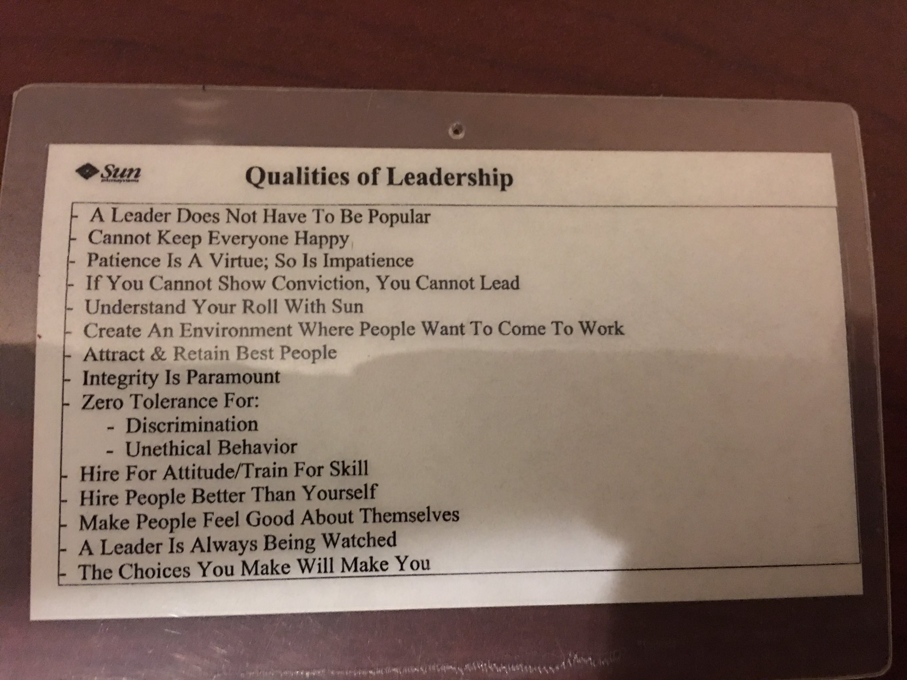

<blockquote class="twitter-tweet tw-align-center" data-lang="es">
Jim, can any company become an open organization?<a href="https://twitter.com/hashtag/CUBEgems?src=hash">#CUBEgems</a> <a href="https://twitter.com/JWhitehurst">@JWhitehurst</a> <a href="https://twitter.com/RedHatNews">@RedHatNews</a> <a href="https://twitter.com/hashtag/RHSummit?src=hash">#RHSummit</a> <a href="https://twitter.com/hashtag/theCUBE?src=hash">#theCUBE</a> <a href="https://t.co/Kg5Qb4KXNM">pic.twitter.com/Kg5Qb4KXNM</a>
&mdash; theCUBE (@theCUBE) <a href="https://twitter.com/theCUBE/status/747844822308794368">28 de junio de 2016</a></blockquote>

<iframe width="560" height="315" src="https://www.youtube.com/embed/kOYcbod5J0w?rel=0" frameborder="0" allowfullscreen class="video"></iframe>

 

<iframe width="560" height="315" src="https://www.youtube.com/embed/sPPfYtFE6og?rel=0" frameborder="0" allowfullscreen class="video"></iframe>

 

<iframe width="560" height="315" src="https://www.youtube.com/embed/v4MiqwYE-5k?rel=0" frameborder="0" allowfullscreen class="video"></iframe>

 

<iframe width="560" height="315" src="https://www.youtube.com/embed/a3pVqMT9DXA?start=2313" frameborder="0" allowfullscreen class="video"></iframe>

 

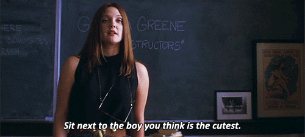

<iframe width="560" height="315" src="https://www.youtube.com/embed/TQ_zhHUu8NE?rel=0" frameborder="0" allowfullscreen class="video"></iframe>

 

<blockquote class="twitter-tweet tw-align-center" data-lang="es">
Barcelona gana a Madrid en la pugna por atraer empresas de Londres tras Brexit <a href="https://t.co/i8j5deYgJ8">https://t.co/i8j5deYgJ8</a> <a href="https://twitter.com/hashtag/negocios?src=hash">#negocios</a> <a href="https://t.co/T5uVfFUDDz">pic.twitter.com/T5uVfFUDDz</a>
&mdash; José Manuel García (@abcTraderClub) <a href="https://twitter.com/abcTraderClub/status/751844450515689472">9 de julio de 2016</a></blockquote>

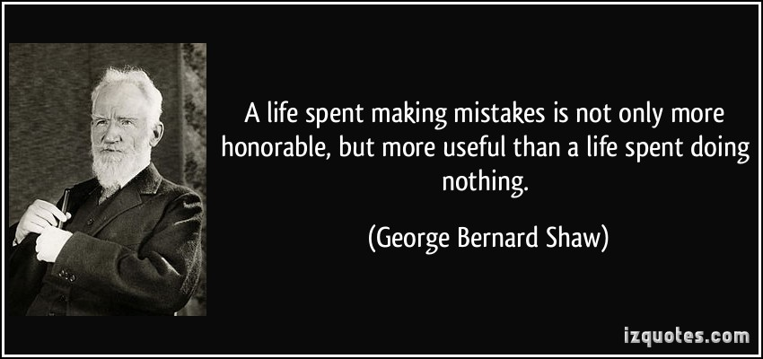

# Culture and collaboration
- [hbr.org: Aligning Your Organization with an Agile Workforce](https://hbr.org/2016/02/aligning-your-organization-with-an-agile-workforce)
- [deloitte: Cultivating the IT Workforce of the Future](http://deloitte.wsj.com/cio/2015/10/20/cultivating-the-it-workforce-of-the-future/)
- [businessinsider.com: 8 mistakes that make great employees leave](http://www.businessinsider.com/8-mistakes-that-make-great-employees-leave-2016-2)
- [Forbes: Addicted To Ambition: 3 Ways Millennials Can Manage Their Stress](http://www.forbes.com/sites/carolinebeaton/2016/02/10/addicted-to-ambition-3-ways-millennials-can-manage-their-stress/)
- [Forbes: How To Successfully Manage A Multigenerational Team 🌟](http://www.forbes.com/sites/adp/2016/02/12/how-to-successfully-manage-a-multigenerational-team)
- [cityam.com: Why you should stop trying to make your team like you](http://www.cityam.com/234743/why-you-should-stop-trying-to-make-your-team-like-you)
- [VW damaged by a culture of fear](https://www.linkedin.com/pulse/vw-damaged-culture-fear-l-david-marquet)
- [Forbes: Seven Ways To Inspire Your Team To Collaborate 🌟🌟🌟](http://www.forbes.com/sites/carolkinseygoman/2016/02/21/seven-ways-to-inspire-your-team-to-collaborate) “How many of you are totally comfortable sharing information with others in your organization?”
- [L. David Marquet: Control In An Emergency 🌟](https://www.linkedin.com/pulse/control-emergency-l-david-marquet)
- [businessinsider.com: 27 jobs to avoid if you hate stress](http://www.businessinsider.com/jobs-to-avoid-if-you-hate-stress-2015-9)
- [businessinsider.com: 13 bad habits you should break in 2016 to be more productive 🌟](http://www.businessinsider.com/bad-habits-that-are-killing-your-productivity-2015-12)
- [Is Workplace Culture Overrated? (Infographic)](https://www.entrepreneur.com/article/276152)
- [careerealism.com: Are You A ‘Cultural Fit’ For The Job?](http://www.careerealism.com/cultural-fit-job/)
- [careerealism.com: 7 Toxic Traits Of A Bad Employer](https://www.linkedin.com/pulse/7-toxic-traits-bad-employer-j-t-o-donnell)
- [Takata recalls, another symptom of culture of fear](https://www.linkedin.com/pulse/takata-recalls-another-symptom-culture-fear-l-david-marquet)
- [entrepreneur.com: Are Our Politicians Leading to the New 'Bully Boss?' 🌟](https://www.entrepreneur.com/article/276026)
- [inc.com: How to Radically Change Your Company Culture (From a Founder Who Once Hated His)](http://www.inc.com/jeff-haden/how-to-radically-change-your-company-culture-from-a-founder-who-once-hated-his.html)
- [Glassdoor.com: How to Deal With a Bad Boss 🌟](https://www.glassdoor.com/blog/manage-bad-boss/)
- [19 signs you're a horrible boss, even if it doesn't feel like it](http://www.businessinsider.com/signs-youre-a-horrible-boss-even-if-it-doesnt-feel-like-it-2016-8)
- [How To Survive A Difficult Boss](https://www.linkedin.com/pulse/how-survive-difficult-boss-dr-travis-bradberry)
- [entrepreneur.com: Unhealthy Culture? Now, What? 🌟](https://www.entrepreneur.com/article/253872)
- [DZone: Technical Leadership in Software Companies 🌟🌟🌟](https://dzone.com/articles/technical-leadership-in-software-companies) The author gives highlights of a recent talk about software leadership, the psyche of developers, and how to lead.
- [opensource.com: Avoiding bad practices in open source project management](https://opensource.com/business/16/6/bad-practice-foss-projects-management)
- [How To Solve The Biggest Threat To Your Office Culture](http://www.content-loop.com/how-to-solve-the-biggest-threat-to-your-office-culture) Have you heard about the single deadliest threat to your office culture? It’s a secret, so I’ll tell you, as long as you promise not to tell anyone. It’s gossip.
- [Jim Whitehurst - Open Everything 🌟🌟🌟](http://www.huffingtonpost.com/entry/jim-whitehurst-open-everything_us_57b64af5e4b07d22cc37464f) Almost everything in the world becomes better when it’s open.
- [gartner.com: Develop an Open Innovation Framework](http://www.gartner.com/smarterwithgartner/develop-an-open-innovation-framework/) The best type of innovation can come from a collaboration between different groups and organizations
- [Our Negative Boss: Unconventional Tactics We Used to Overcome The 2nd Worst Boss Ever 🌟🌟](https://www.linkedin.com/pulse/our-negative-boss-unconventional-tactics-we-used-2nd-worst-mccracken)
- [entrepreneur.com: How to Survive in a Competitive World 🌟🌟](https://www.entrepreneur.com/article/232653)

<blockquote class="twitter-tweet tw-align-center" data-lang="es">
Finextra TV: Cultural change crucial in digital transformation <a href="https://t.co/0dnxP26UQy">https://t.co/0dnxP26UQy</a> <a href="https://twitter.com/hashtag/fintech?src=hash">#fintech</a> <a href="https://t.co/pTaeZu8ON3">pic.twitter.com/pTaeZu8ON3</a>
&mdash; Finextra (@Finextra) <a href="https://twitter.com/Finextra/status/768751313748369408">25 de agosto de 2016</a></blockquote>

<blockquote class="twitter-tweet tw-align-center" data-lang="es">
34 things you should never say during a performance review <a href="https://t.co/C6ObUtWQtc">https://t.co/C6ObUtWQtc</a> <a href="https://t.co/K38X3tssVV">pic.twitter.com/K38X3tssVV</a>
&mdash; Business Insider (@businessinsider) <a href="https://twitter.com/businessinsider/status/737674830695288832">31 de mayo de 2016</a></blockquote>

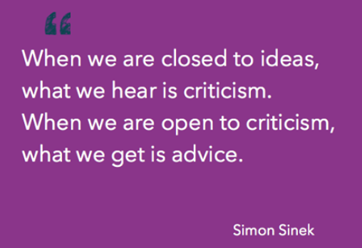

<blockquote class="twitter-tweet tw-align-center" data-lang="es">
<a href="https://t.co/QFVSHwGov0">https://t.co/QFVSHwGov0</a>
&mdash; RedHatSpain (@RedHatSpain) <a href="https://twitter.com/RedHatSpain/status/749294104027201536">2 de julio de 2016</a></blockquote>

<blockquote class="twitter-tweet tw-align-center" data-lang="es">
In meritocracies, leaders can emerge anywhere—if you let them. <a href="https://twitter.com/jackieyeaney">@JackieYeaney</a> explains how to do it: <a href="https://t.co/VJ30cSKDdr">https://t.co/VJ30cSKDdr</a>
&mdash; Open Source Way (@opensourceway) <a href="https://twitter.com/opensourceway/status/746567347402481664">25 de junio de 2016</a></blockquote>

<iframe width="560" height="315" src="https://www.youtube.com/embed/JZQcEPEaWYc?rel=0" frameborder="0" allowfullscreen class="video"></iframe>

 

[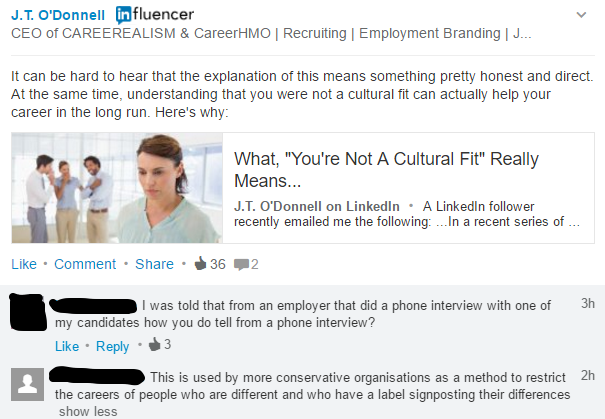](https://www.linkedin.com/pulse/what-youre-cultural-fit-really-means-j-t-o-donnell)

<blockquote class="twitter-tweet tw-align-center" data-lang="es">
When the boss or client asks for a server/network problem fix update... <a href="https://twitter.com/hashtag/sysadmin?src=hash">#sysadmin</a> <a href="https://twitter.com/hashtag/linux?src=hash">#linux</a> <a href="https://twitter.com/hashtag/unix?src=hash">#unix</a> <a href="https://twitter.com/hashtag/IT?src=hash">#IT</a> <a href="https://t.co/ZLTc1btGl9">pic.twitter.com/ZLTc1btGl9</a>
&mdash; nixCraft (@nixcraft) <a href="https://twitter.com/nixcraft/status/751421639435259904">8 de julio de 2016</a></blockquote>

<iframe width="420" height="315" src="https://www.youtube.com/embed/o9Q0kp8CMFQ?rel=0" frameborder="0" allowfullscreen class="video"></iframe>

 

<blockquote class="twitter-tweet tw-align-center" data-lang="es">
Game of inches<a href="https://t.co/SwBSum936R">https://t.co/SwBSum936R</a>
&mdash; Famps (@ElFamps) <a href="https://twitter.com/ElFamps/status/708649150548742144">12 de marzo de 2016</a></blockquote>

<blockquote class="twitter-tweet tw-align-center" data-lang="es">
So much of what we call management consists in making it difficult for people to work. —Drucker <a href="https://t.co/rB8ghD9ss7">pic.twitter.com/rB8ghD9ss7</a>
&mdash; Vala Afshar (@ValaAfshar) <a href="https://twitter.com/ValaAfshar/status/714838123578982400">29 de marzo de 2016</a></blockquote>

<iframe width="560" height="315" src="https://www.youtube.com/embed/6F6vfvVQODI?rel=0" frameborder="0" allowfullscreen class="video"></iframe>

 

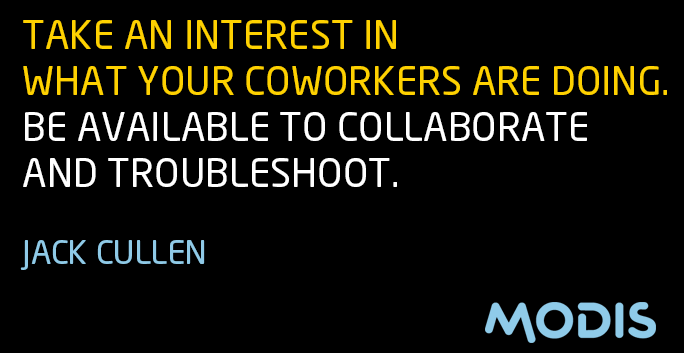

<blockquote class="twitter-tweet tw-align-center" data-lang="es">
Dirigir mediante el ‘ordeno y mando’ ya no es rentable ➡ <a href="https://t.co/j1AsBqR0wJ">https://t.co/j1AsBqR0wJ</a> <a href="https://twitter.com/hashtag/RRHH?src=hash">#RRHH</a> <a href="https://twitter.com/hashtag/Liderazgo?src=hash">#Liderazgo</a> <a href="https://t.co/icL3QBREfQ">pic.twitter.com/icL3QBREfQ</a>
&mdash; Movistar pymes (@Movistar_pymes) <a href="https://twitter.com/Movistar_pymes/status/739140034016731136">4 de junio de 2016</a></blockquote>

<blockquote class="twitter-tweet tw-align-center" data-lang="es">
A blame culture at work. Here we see a &quot;manager&quot; or a &quot;politician&quot; in their natural habitat. <a href="https://t.co/bAwQlPkXwU">pic.twitter.com/bAwQlPkXwU</a>
&mdash; nixCraft # (@nixcraft) <a href="https://twitter.com/nixcraft/status/768703393183338497">25 de agosto de 2016</a></blockquote>

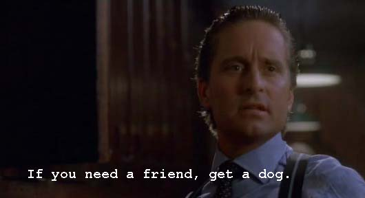

<blockquote class="twitter-tweet tw-align-center" data-lang="es">
Maria Sharapova receives two-year suspension from tennis for failed drug test <a href="https://t.co/JVWuQMc9jp">https://t.co/JVWuQMc9jp</a> <a href="https://t.co/ccfi4kmjXl">pic.twitter.com/ccfi4kmjXl</a>
&mdash; Business Insider (@businessinsider) <a href="https://twitter.com/businessinsider/status/740560273895985152">8 de junio de 2016</a></blockquote>

<blockquote class="twitter-tweet tw-align-center" data-lang="es">
&quot;If a girl looks good, she&#39;s probably not good at her work.&quot; Bang on, seen this bias so often. <a href="https://twitter.com/hashtag/BestATWork?src=hash">#BestATWork</a> <a href="https://t.co/argHHU61YN">https://t.co/argHHU61YN</a>
&mdash; Kiran Manral (@KiranManral) <a href="https://twitter.com/KiranManral/status/774570723603980289">10 de septiembre de 2016</a></blockquote>

<iframe src="//es.slideshare.net/slideshow/embed_code/key/BYA1zNZmsN7dqC" width="595" height="485" frameborder="0" marginwidth="0" marginheight="0" scrolling="no" style="border:1px solid #CCC; border-width:1px; margin-bottom:5px; max-width: 100%;" allowfullscreen class="video"> </iframe> 
 <strong> <a href="//es.slideshare.net/SuharshHarsha/business-etiquette-and-culture-in-europe" title="BUSINESS ETIQUETTE AND CULTURE IN EUROPE " target="_blank">BUSINESS ETIQUETTE AND CULTURE IN EUROPE </a> </strong> from <strong><a target="_blank" href="//es.slideshare.net/SuharshHarsha">Suharsh L</a></strong> 

 

<blockquote class="twitter-tweet tw-align-center" data-lang="es">
<a href="https://t.co/Bz0D2LX8ul">https://t.co/Bz0D2LX8ul</a> <a href="https://t.co/msw1wBkbnJ">pic.twitter.com/msw1wBkbnJ</a>
&mdash; David Marquet (@ldavidmarquet) <a href="https://twitter.com/ldavidmarquet/status/738837979712610305">3 de junio de 2016</a></blockquote>

<iframe src="//www.slideshare.net/slideshow/embed_code/key/32i7dUYEeZCEmm" width="595" height="485" frameborder="0" marginwidth="0" marginheight="0" scrolling="no" style="border:1px solid #CCC; border-width:1px; margin-bottom:5px; max-width: 100%;" allowfullscreen class="video"> </iframe> 
 <strong> <a href="//www.slideshare.net/Rypple/good-boss-bad-boss" title="Good Boss, Bad Boss - Robert Sutton from Stanford" target="_blank">Good Boss, Bad Boss - Robert Sutton from Stanford</a> </strong> from <strong><a target="_blank" href="//www.slideshare.net/Rypple">Work.com - A Salesforce Company</a></strong> 

 

<iframe src="//www.slideshare.net/slideshow/embed_code/key/Fkhw8cP5i7Rgbf" width="595" height="485" frameborder="0" marginwidth="0" marginheight="0" scrolling="no" style="border:1px solid #CCC; border-width:1px; margin-bottom:5px; max-width: 100%;" allowfullscreen class="video"> </iframe> 
 <strong> <a href="//www.slideshare.net/amirsaiftaz/11-habits-of-bad-boss-presentation" title="11 Habits Of Bad Boss" target="_blank">11 Habits Of Bad Boss</a> </strong> from <strong><a target="_blank" href="//www.slideshare.net/amirsaiftaz">Self Creation </a></strong> 

 

<blockquote class="twitter-tweet tw-align-center" data-lang="es">
&quot;Winners focus on winning, losers focus on winners&quot; <a href="https://t.co/0XIXjed3hA">pic.twitter.com/0XIXjed3hA</a>
&mdash; Brett Ballard (@CoachBBallard) <a href="https://twitter.com/CoachBBallard/status/763200881944911872">10 de agosto de 2016</a></blockquote>

<iframe src="//www.slideshare.net/slideshow/embed_code/key/1Gx0ff7YjTyWca" width="595" height="485" frameborder="0" marginwidth="0" marginheight="0" scrolling="no" style="border:1px solid #CCC; border-width:1px; margin-bottom:5px; max-width: 100%;" allowfullscreen class="video"> </iframe> 
 <strong> <a href="//www.slideshare.net/dbenoni/12-characteristicsofhorribleboss" title="12 Characteristics of A Horrible Boss" target="_blank">12 Characteristics of A Horrible Boss</a> </strong> from <strong><a target="_blank" href="//www.slideshare.net/dbenoni">Dan Benoni</a></strong> 

 

<iframe src="//www.slideshare.net/slideshow/embed_code/key/JlJjeOzMGARUGa" width="595" height="485" frameborder="0" marginwidth="0" marginheight="0" scrolling="no" style="border:1px solid #CCC; border-width:1px; margin-bottom:5px; max-width: 100%;" allowfullscreen class="video"> </iframe> 
 <strong> <a href="//www.slideshare.net/Officevibe/10-ways-your-boss-kills-employee-motivation" title="10 Ways Your Boss Kills Employee Motivation" target="_blank">10 Ways Your Boss Kills Employee Motivation</a> </strong> from <strong><a href="//www.slideshare.net/Officevibe" target="_blank">Officevibe</a></strong> 

 

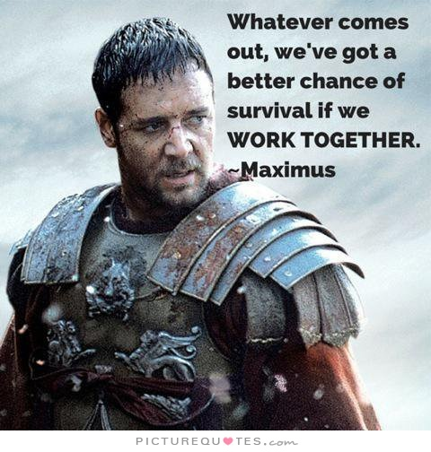

<blockquote class="twitter-tweet tw-align-center" data-lang="es">
¿Empleado obediente, empleado feliz? <a href="https://t.co/cmLa4B1NFO">https://t.co/cmLa4B1NFO</a> vía <a href="https://twitter.com/balcon40">@balcon40</a>
&mdash; Roberto García Esteb (@72rge) <a href="https://twitter.com/72rge/status/751524871688052736">8 de julio de 2016</a></blockquote>

<iframe src="//www.slideshare.net/slideshow/embed_code/key/1H6fog0r6z2Kot" width="595" height="485" frameborder="0" marginwidth="0" marginheight="0" scrolling="no" style="border:1px solid #CCC; border-width:1px; margin-bottom:5px; max-width: 100%;" allowfullscreen class="video"> </iframe> 
 <strong> <a href="//www.slideshare.net/dbenoni/personality-traits-of-a-great-boss-44358501" title="12 Personality Traits Of A Great Boss " target="_blank">12 Personality Traits Of A Great Boss </a> </strong> from <strong><a target="_blank" href="//www.slideshare.net/dbenoni">Dan Benoni</a></strong> 

 

<iframe src="//www.slideshare.net/slideshow/embed_code/key/hSoK6TTGrYXjje" width="595" height="485" frameborder="0" marginwidth="0" marginheight="0" scrolling="no" style="border:1px solid #CCC; border-width:1px; margin-bottom:5px; max-width: 100%;" allowfullscreen class="video"> </iframe> 
 <strong> <a href="//www.slideshare.net/dbenoni/how-to-be-happy-at-work-10-simple-tips-that-work" title="How to Be Happy at Work - 10 Simple Tips That Work" target="_blank">How to Be Happy at Work - 10 Simple Tips That Work</a> </strong> from <strong><a target="_blank" href="//www.slideshare.net/dbenoni">Dan Benoni</a></strong> 

 

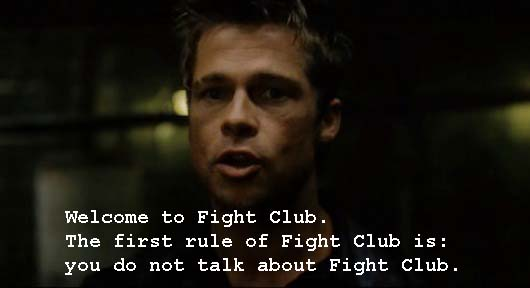

<iframe src="//www.slideshare.net/slideshow/embed_code/key/IQkukxYFL4fH6l" width="595" height="485" frameborder="0" marginwidth="0" marginheight="0" scrolling="no" style="border:1px solid #CCC; border-width:1px; margin-bottom:5px; max-width: 100%;" allowfullscreen class="video"> </iframe> 
 <strong> <a href="//www.slideshare.net/dbenoni/difference-betweenbossvsleader" title="13 Personality Traits Of A Horrible Employee" target="_blank">13 Personality Traits Of A Horrible Employee</a> </strong> from <strong><a target="_blank" href="//www.slideshare.net/dbenoni">Dan Benoni</a></strong> 

 

<iframe width="560" height="315" src="https://www.youtube.com/embed/XjPSGuJskxM?rel=0" frameborder="0" allowfullscreen class="video"></iframe>

 

<blockquote class="twitter-tweet tw-align-center" data-lang="es">
Help! My boss doesn&#39;t do any work and takes credit for everything I do <a href="https://t.co/O83AHc1wpP">https://t.co/O83AHc1wpP</a> <a href="https://t.co/RFWT4fhFlc">pic.twitter.com/RFWT4fhFlc</a>
&mdash; Business Insider (@businessinsider) <a href="https://twitter.com/businessinsider/status/717387777718009858">5 de abril de 2016</a></blockquote>

<blockquote class="twitter-tweet tw-align-center" data-lang="es">
The hidden costs of burnout <a href="https://t.co/kEuVbJi73L">https://t.co/kEuVbJi73L</a>
&mdash; Forbes (@Forbes) <a href="https://twitter.com/Forbes/status/708754688431280128">12 de marzo de 2016</a></blockquote>

<blockquote class="twitter-tweet tw-align-center" data-lang="es">
.<a href="https://twitter.com/JWhitehurst">@JWhitehurst</a> on The Open Organization: One year later <a href="https://t.co/Jj8fbPCvaj">https://t.co/Jj8fbPCvaj</a> <a href="https://twitter.com/hashtag/RedHat?src=hash">#RedHat</a> <a href="https://twitter.com/hashtag/TheOpenOrg?src=hash">#TheOpenOrg</a> <a href="https://t.co/TCt9POclr2">pic.twitter.com/TCt9POclr2</a>
&mdash; Red Hat, Inc. (@RedHatNews) <a href="https://twitter.com/RedHatNews/status/738767205261660162">3 de junio de 2016</a></blockquote>

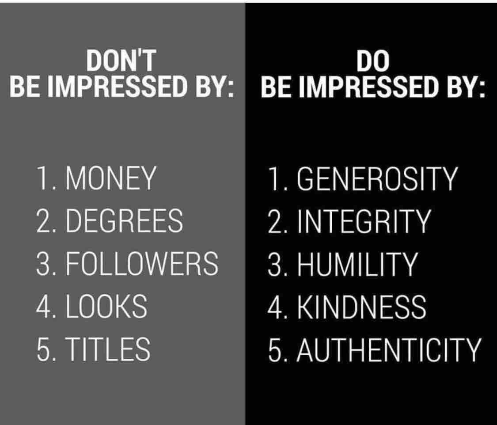

<blockquote class="twitter-tweet tw-align-center" data-lang="es">
4 reasons why team-building exercises can actually damage your workplace: <a href="https://t.co/qy7T7yyrOW">https://t.co/qy7T7yyrOW</a> <a href="https://t.co/YP8apfHwJJ">pic.twitter.com/YP8apfHwJJ</a>
&mdash; Forbes (@Forbes) <a href="https://twitter.com/Forbes/status/714059645166493698">27 de marzo de 2016</a></blockquote>

<blockquote class="twitter-tweet tw-align-center" data-lang="es">
<a href="https://t.co/1YyemsOqr1">https://t.co/1YyemsOqr1</a>
&mdash; RedHatSpain (@RedHatSpain) <a href="https://twitter.com/RedHatSpain/status/747694658759843840">28 de junio de 2016</a></blockquote>

<blockquote class="twitter-tweet tw-align-center" data-lang="es">
Bullying, violence and mean behavior costs American businesses billions of dollars each year <a href="https://t.co/K4r3cW6ZMS">https://t.co/K4r3cW6ZMS</a> <a href="https://t.co/RgbDYDrnrA">pic.twitter.com/RgbDYDrnrA</a>
&mdash; Forbes (@Forbes) <a href="https://twitter.com/Forbes/status/734343298958131200">22 de mayo de 2016</a></blockquote>

<blockquote class="twitter-tweet tw-align-center" data-lang="es">
Philip Seymour Hoffman <a href="https://t.co/WeScIKb5JC">pic.twitter.com/WeScIKb5JC</a>
&mdash; Actor Trivia (@ActorTrivia) <a href="https://twitter.com/ActorTrivia/status/719513410501812224">11 de abril de 2016</a></blockquote>

<blockquote class="twitter-tweet tw-align-center" data-lang="es">
Series de fuera de EEUU que le están dando una &quot;paliza&quot; a las americanas <a href="https://t.co/uejF7it5mp">https://t.co/uejF7it5mp</a> <a href="https://t.co/4iB7r6V3NH">pic.twitter.com/4iB7r6V3NH</a>
&mdash; xataka (@xataka) <a href="https://twitter.com/xataka/status/736936414168879104">29 de mayo de 2016</a></blockquote>

<iframe width="560" height="315" src="https://www.youtube.com/embed/H4gOYlBO0ys?rel=0" frameborder="0" allowfullscreen class="video"></iframe>

 

<iframe width="560" height="315" src="https://www.youtube.com/embed/ZhyuuwkwSao?rel=0" frameborder="0" allowfullscreen class="video"></iframe>

 

<iframe width="560" height="315" src="https://www.youtube.com/embed/qHw9e3iVhKQ?rel=0" frameborder="0" allowfullscreen class="video"></iframe>

 

<iframe width="560" height="315" src="https://www.youtube.com/embed/diPEBQgrrb8?rel=0" frameborder="0" allowfullscreen class="video"></iframe>

 

<blockquote class="twitter-tweet tw-align-center" data-lang="es">
Once someone starts disrespecting you. It is so hard to ever get them to stop....best to just walk away. <a href="https://t.co/2tYzUf9f0Q">pic.twitter.com/2tYzUf9f0Q</a>
&mdash; ✨Påυυιđå❤️ (@krua6497) <a href="https://twitter.com/krua6497/status/701213378069417984">21 de febrero de 2016</a></blockquote>

<iframe width="420" height="315" src="https://www.youtube.com/embed/Q1BYdYztj08?rel=0" frameborder="0" allowfullscreen class="video"></iframe>

 

<blockquote class="twitter-tweet tw-align-center" data-lang="es">
Dramático final en las <a href="https://twitter.com/24hoursoflemans">@24hoursoflemans</a>. El Toyota del líder se paró a 4 minutos del final  <a href="https://t.co/ADCIQuYZMw">https://t.co/ADCIQuYZMw</a>
&mdash; Pablo Muñoz Portillo (@pablom_portillo) <a href="https://twitter.com/pablom_portillo/status/744527269457178625">19 de junio de 2016</a></blockquote>

<iframe src="https://player.vimeo.com/video/161551058" width="500" height="281" frameborder="0" webkitallowfullscreen mozallowfullscreen allowfullscreen class="video"></iframe>
<a href="https://vimeo.com/161551058">Persigue tu sue&ntilde;o, supera los obst&aacute;culos - Javier Gomez Noya</a> from <a href="https://vimeo.com/bridgestoneeurope">Bridgestone</a> on <a href="https://vimeo.com">Vimeo</a>.

 

<iframe width="560" height="315" src="https://www.youtube.com/embed/xwfMVsH23RI?rel=0" frameborder="0" allowfullscreen class="video"></iframe>

 

<iframe width="560" height="315" src="https://www.youtube.com/embed/PWle59ZHPIM?rel=0" frameborder="0" allowfullscreen class="video"></iframe>

 

<iframe width="560" height="315" src="https://www.youtube.com/embed/1Lydp4y2O4Y?rel=0" frameborder="0" allowfullscreen class="video"></iframe>

 

<iframe width="560" height="315" src="https://www.youtube.com/embed/MLXPrGtHXMo?rel=0" frameborder="0" allowfullscreen class="video"></iframe>

 

<blockquote class="twitter-tweet tw-align-center" data-lang="es">
PHOTOS: The 10 happiest jobs: <a href="https://t.co/Dw88jn7gkY">https://t.co/Dw88jn7gkY</a> <a href="https://t.co/R1LYgpgOIT">pic.twitter.com/R1LYgpgOIT</a>
&mdash; Forbes (@Forbes) <a href="https://twitter.com/Forbes/status/705837970125950976">4 de marzo de 2016</a></blockquote>

<blockquote class="twitter-tweet tw-align-center" data-lang="es">
CÓMO GANARTE EL RESPETO DE TUS COLEGAS ( c/ <a href="https://twitter.com/AntonLofer">@AntonLofer</a> <a href="https://twitter.com/wasabihumor">@wasabihumor</a> <a href="https://twitter.com/polifaceticoo">@polifaceticoo</a> <a href="https://twitter.com/pop_cont">@pop_cont</a> ) <a href="https://t.co/fNmKYNPFsw">pic.twitter.com/fNmKYNPFsw</a>
&mdash; Michenlo (@michenlo) <a href="https://twitter.com/michenlo/status/750408961237581824">5 de julio de 2016</a></blockquote>

<blockquote class="twitter-tweet tw-align-center" data-lang="es">
Diversity in the workplace should be celebrated. But not the box-ticking kind <a href="https://t.co/u9sBkBTFLy">https://t.co/u9sBkBTFLy</a> <a href="https://t.co/gk0i6jgteb">pic.twitter.com/gk0i6jgteb</a>
&mdash; The Economist (@TheEconomist) <a href="https://twitter.com/TheEconomist/status/699642973957595137">febrero 16, 2016</a></blockquote>

<blockquote class="twitter-tweet tw-align-center" data-lang="es">
17 signs your boss is about to quit <a href="https://t.co/sielMFFp1q">https://t.co/sielMFFp1q</a> <a href="https://t.co/yCiUljiHCL">pic.twitter.com/yCiUljiHCL</a>
&mdash; Business Insider (@businessinsider) <a href="https://twitter.com/businessinsider/status/699651429959598081">febrero 16, 2016</a></blockquote>

<blockquote class="twitter-tweet tw-align-center" data-lang="es">
How loyal are millennial employees? <a href="https://t.co/uaNXKspauh">https://t.co/uaNXKspauh</a> <a href="https://twitter.com/hashtag/work?src=hash">#work</a> <a href="https://t.co/LYBQbboeD2">pic.twitter.com/LYBQbboeD2</a>
&mdash; World Economic Forum (@wef) <a href="https://twitter.com/wef/status/701055035623526400">febrero 20, 2016</a></blockquote>

<blockquote class="twitter-tweet tw-align-center" data-lang="es">
Show me a person who has never made a mistake and I&#39;ll show you somebody who has never achieved much. ~ Joan Collins
&mdash; Zen Moments (@Zen_Moments) <a href="https://twitter.com/Zen_Moments/status/702151633334046720">febrero 23, 2016</a></blockquote>

<blockquote class="twitter-tweet tw-align-center" data-lang="es">
This is why relationships matter at work: <a href="https://t.co/rB6g8Y6G3v">https://t.co/rB6g8Y6G3v</a>
&mdash; Forbes (@Forbes) <a href="https://twitter.com/Forbes/status/711241072442265600">19 de marzo de 2016</a></blockquote>

<iframe src="//www.slideshare.net/slideshow/embed_code/key/d9g3OyefZdAZTQ" width="595" height="485" frameborder="0" marginwidth="0" marginheight="0" scrolling="no" style="border:1px solid #CCC; border-width:1px; margin-bottom:5px; max-width: 100%;" allowfullscreen class="video"> </iframe> 
 <strong> <a href="//www.slideshare.net/preciousssa/hofstede-cultural-differences-in-international-management" title="Hofstede - Cultural differences in international management" target="_blank">Hofstede - Cultural differences in international management</a> </strong> from <strong><a href="//www.slideshare.net/preciousssa" target="_blank">Carmen Neghina</a></strong> 

 

<iframe width="420" height="315" src="https://www.youtube.com/embed/5NP8y63Ms4o?rel=0" frameborder="0" allowfullscreen class="video"></iframe>

 

<blockquote class="twitter-tweet tw-align-center" data-lang="es">
Saying goodbye. Kobe Bryant and Pau Gasol  (Getty)<a href="https://twitter.com/hashtag/photooftheday?src=hash">#photooftheday</a><a href="https://t.co/ioTwwikD1O">https://t.co/ioTwwikD1O</a> <a href="https://t.co/wcHxHi4otO">pic.twitter.com/wcHxHi4otO</a>
&mdash; Paul Nisely (@SN_Paul_Nisely) <a href="https://twitter.com/SN_Paul_Nisely/status/701926990601781249">23 de febrero de 2016</a></blockquote>

<blockquote class="twitter-tweet tw-align-center" data-lang="es">
Christian Bale: Heath Ledger&#39;s Performance as The Joker &#39;Ruined All My Plans&#39;: In a new interview, he says fee.. <a href="https://t.co/024tbsBzsr">https://t.co/024tbsBzsr</a>
&mdash; Diamond Live (@BijouBijounet) <a href="https://twitter.com/BijouBijounet/status/705873205714673666">4 de marzo de 2016</a></blockquote>

<blockquote class="twitter-tweet tw-align-center" data-lang="es">
Jason Kidd era un mago del balón. Magia en sus manos. 🔝😵 <a href="https://t.co/q3NqVMQwPJ">https://t.co/q3NqVMQwPJ</a>
&mdash; EstadisticasNBA (@EstadisticasNBA) <a href="https://twitter.com/EstadisticasNBA/status/708752807676026880">12 de marzo de 2016</a></blockquote>

<iframe width="420" height="315" src="https://www.youtube.com/embed/rm81LSKJC2k?rel=0" frameborder="0" allowfullscreen class="video"></iframe>

 

[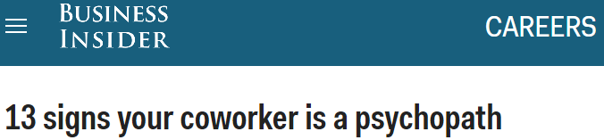](http://www.businessinsider.com/more-signs-you-are-working-with-a-psychopath-2016-7)

<iframe width="560" height="315" src="https://www.youtube.com/embed/HyJxZ8LXPcI?rel=0" frameborder="0" allowfullscreen class="video"></iframe>

 

<blockquote class="twitter-tweet tw-align-center" data-lang="es">
The professions with the most psychopaths <a href="https://t.co/ad1mA17cuR">https://t.co/ad1mA17cuR</a> <a href="https://t.co/BuJdG1JIOZ">pic.twitter.com/BuJdG1JIOZ</a>
&mdash; The Independent (@Independent) <a href="https://twitter.com/Independent/status/754221544084115458">16 de julio de 2016</a></blockquote>

<iframe width="560" height="315" src="https://www.youtube.com/embed/G6v6rdSYyaA?rel=0" frameborder="0" allowfullscreen class="video"></iframe>

 

<iframe width="560" height="315" src="https://www.youtube.com/embed/NyaQhNHhgw4?rel=0" frameborder="0" allowfullscreen class="video"></iframe>

 

<iframe width="560" height="315" src="https://www.youtube.com/embed/tlhDW89Bid0?rel=0" frameborder="0" allowfullscreen class="video"></iframe>

 

<iframe width="560" height="315" src="https://www.youtube.com/embed/mmXUtwSIzmM?start=167" frameborder="0" allowfullscreen class="video"></iframe>

 

<iframe width="560" height="315" src="https://www.youtube.com/embed/uzt6vlpdZWM?rel=0" frameborder="0" allowfullscreen class="video"></iframe>

 

<blockquote class="twitter-tweet tw-align-center" data-lang="es">
Destrozan las lunas de 50 coches eléctricos de alquiler en Madrid <a href="https://t.co/TpuOGvGf4Q">https://t.co/TpuOGvGf4Q</a> <a href="https://t.co/kIYRKOAFJy">pic.twitter.com/kIYRKOAFJy</a>
&mdash; El Mundo Madrid (@ElMundo_Madrid) <a href="https://twitter.com/ElMundo_Madrid/status/686115082372296704">10 de enero de 2016</a></blockquote>

<blockquote class="twitter-tweet tw-align-center" data-lang="es">
Michael Jordan iba muuuuy sobrado. Uno de los mejores Fake Shot jamás vistos.  <a href="https://t.co/5Rtb6SxGJv">https://t.co/5Rtb6SxGJv</a>
&mdash; EstadisticasNBA (@EstadisticasNBA) <a href="https://twitter.com/EstadisticasNBA/status/713851916179152897">26 de marzo de 2016</a></blockquote>

<iframe width="560" height="315" src="https://www.youtube.com/embed/bL2KBIwcUGE?rel=0" frameborder="0" allowfullscreen class="video"></iframe>

 

<iframe width="560" height="315" src="https://www.youtube.com/embed/ZNnNbzHtVaU?rel=0" frameborder="0" allowfullscreen class="video"></iframe>

 

