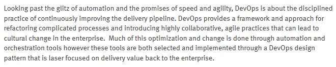
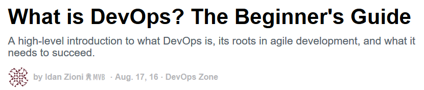

**Table of Contents**
<!-- MarkdownTOC -->

- [DevOps](#devops)
	- [DevOps Blogs and Podcasts](#devops-blogs-and-podcasts)
	- [Description](#description)
	- [Cultura DevOps](#cultura-devops)
	- [Collaborative tools](#collaborative-tools)
	- [DevOps Tools 2016](#devops-tools-2016)
		- [Rundeck](#rundeck)
		- [Server Provisioning and Automation: Red Hat Satellite, Katello, Foreman, Cobbler and others](#server-provisioning-and-automation-red-hat-satellite-katello-foreman-cobbler-and-others)
	- [Agile planning: Scrum, Kanban, Lean, Project Management, CI/CD](#agile-planning-scrum-kanban-lean-project-management-cicd)
	- [Metrics](#metrics)
	- [Examples of DevOps Job description](#examples-of-devops-job-description)
		- [Example 1](#example-1)
		- [Example 2](#example-2)
		- [Example 3](#example-3)
		- [Example 4](#example-4)
- [ITIL](#itil)
	- [Is DevOps replacing ITIL?](#is-devops-replacing-itil)
	- [ITIL Tools](#itil-tools)

<!-- /MarkdownTOC -->

<blockquote class="twitter-tweet tw-align-center" data-lang="es">
What is <a href="https://twitter.com/hashtag/DevOps?src=hash">#DevOps</a>, anyway? <a href="https://t.co/0tvL5uQjvx">https://t.co/0tvL5uQjvx</a>
&mdash; Red Hat EMEA (@RedHatEMEA) <a href="https://twitter.com/RedHatEMEA/status/714001576554323968">27 de marzo de 2016</a></blockquote>

<blockquote class="twitter-tweet tw-align-center" data-lang="es">
LOL. Via <a href="https://t.co/HWulUfrhmk">https://t.co/HWulUfrhmk</a> <a href="https://twitter.com/hashtag/humor?src=hash">#humor</a> <a href="https://twitter.com/hashtag/parkinsonslaw?src=hash">#parkinsonslaw</a> <a href="https://t.co/cNcwbP3UyQ">pic.twitter.com/cNcwbP3UyQ</a>
&mdash; nixCraft (@nixcraft) <a href="https://twitter.com/nixcraft/status/714018152120606721">27 de marzo de 2016</a></blockquote>

<blockquote class="twitter-tweet tw-align-center" data-lang="es">
51 Best DevOps Tools for <a href="https://twitter.com/hashtag/DevOps?src=hash">#DevOps</a> Engineers <a href="http://t.co/OYP0PuFoSI">http://t.co/OYP0PuFoSI</a>  What tools are you using?
&mdash; ProfitBricks (@ProfitBricksUSA) <a href="https://twitter.com/ProfitBricksUSA/status/568069464572489729">18 de febrero de 2015</a></blockquote>

<blockquote class="twitter-tweet tw-align-center" data-lang="es">
...<a href="https://twitter.com/hashtag/cloud?src=hash">#cloud</a> + <a href="https://twitter.com/hashtag/analytics?src=hash">#analytics</a> + <a href="https://twitter.com/hashtag/IoT?src=hash">#IoT</a> + <a href="https://twitter.com/hashtag/DevOps?src=hash">#DevOps</a> + <a href="https://twitter.com/hashtag/Dilbert?src=hash">#Dilbert</a> = Priceless Humor <a href="https://t.co/fPnuWQEc2n">pic.twitter.com/fPnuWQEc2n</a>
&mdash; Sharat (@Sharat_Chander) <a href="https://twitter.com/Sharat_Chander/status/717495274663333889">5 de abril de 2016</a></blockquote>

<blockquote class="twitter-tweet tw-align-center" data-lang="es">
Best way to get foot in the door of devops (currently system admin) : devops <a href="https://t.co/2K1dYh93cb">https://t.co/2K1dYh93cb</a> via <a href="https://twitter.com/CodeIgnition">@CodeIgnition</a>
&mdash; Devops Top News (@DevopsTopNews) <a href="https://twitter.com/DevopsTopNews/status/744473901455990784">19 de junio de 2016</a></blockquote>

<blockquote class="twitter-tweet tw-align-center" data-lang="es">
Tech jobs report: security, <a href="https://twitter.com/hashtag/DevOps?src=hash">#DevOps</a>, and <a href="https://twitter.com/hashtag/BigData?src=hash">#BigData</a> stay hot <a href="https://t.co/gphg2ibB7W">https://t.co/gphg2ibB7W</a> via <a href="https://twitter.com/infoworld">@infoworld</a> <a href="https://twitter.com/hashtag/cloud?src=hash">#cloud</a> <a href="https://t.co/cVzlNDLS2c">pic.twitter.com/cVzlNDLS2c</a>
&mdash; Paul Denham (@PaulTDenham) <a href="https://twitter.com/PaulTDenham/status/748168909656719360">29 de junio de 2016</a></blockquote>

<blockquote class="twitter-tweet tw-align-center" data-lang="es">
<a href="https://t.co/3GuOGcGDNW">https://t.co/3GuOGcGDNW</a>
&mdash; inafevDevOps (@inafevDevOps) <a href="https://twitter.com/inafevDevOps/status/752924831147057152">12 de julio de 2016</a></blockquote>

<blockquote class="twitter-tweet tw-align-center" data-lang="es">
Chef CTO urges action to prevent DevOps staff burnout <a href="https://t.co/HjZhuzDfIi">https://t.co/HjZhuzDfIi</a>  <a href="https://twitter.com/hashtag/devops?src=hash">#devops</a> <a href="https://t.co/YEzshkPOPa">pic.twitter.com/YEzshkPOPa</a>
&mdash; DevOps Guy (@DevopsG) <a href="https://twitter.com/DevopsG/status/754408207120871424">16 de julio de 2016</a></blockquote>

# DevOps
## DevOps Blogs and Podcasts
- [devops.com](http://devops.com/)
- [TechBeacon.com](http://techbeacon.com/) Practical Knowledge for dev and tech pros
- [DevOps Library: The Best Videos for the Best Admins](http://devopslibrary.com/)
- [DZone/DevOps Zone](https://dzone.com/devops-tutorials-tools-news)
- [DevOpsCube](http://devopscube.com/)
- [DevOpsSummit Blog](http://devops.sys-con.com/)
- [20 DevOps Leaders to Follow on Twitter](https://dzone.com/articles/20-devops-leaders-to-follow-on-twitter)
- [redhat.com On-demand webinars about DevOps](http://www.redhat.com/en/about/events/devops-webinars)
- [github: DevopsWiki](https://github.com/Leo-G/DevopsWiki) A wiki of Guides, Scripts, Tutorials related to devops
- [Accenture DevOps Blog](https://www.accenture.com/us-en/blogs/blogs-accenture-devops.aspx)
- [List of DevOps Blogs and Resources for Learning](http://devopscube.com/list-of-devops-blogs-and-resources/)
	1. [Dzone DevOps](https://dzone.com/devops-tutorials-tools-news)
	2. [Devops.com](http://devops.com/)
	3. [TechTarget Devops](http://www.techtarget.com/technology/DevOps)
	4. [Devops Sub-Reddit](https://www.reddit.com/r/devops)
	5. [Devops on Quora](https://www.quora.com/topic/DevOps)
	6. [Dev2Ops.org](http://dev2ops.org/)
	7. Linkedin Groups
		- [DevOps](https://www.linkedin.com/groups/2825397)
		- [Devops discussions](https://www.linkedin.com/groups/6585254)
	8. Devops Podcasts
		- [Arrested Devops](https://www.arresteddevops.com)
		- [The ship show](http://theshipshow.com/)
		- [Devops Cafe](http://devopscafe.org/)
		- [The Ops Team](https://channel9.msdn.com/Shows/The-Ops-Team)

<blockquote class="twitter-tweet tw-align-center" data-lang="es">
The Ops Team #023 - &quot;Free, like a Puppy&quot; <a href="https://t.co/wWjB4XzuI1">https://t.co/wWjB4XzuI1</a>  <a href="https://twitter.com/hashtag/devops?src=hash">#devops</a> <a href="https://t.co/doxWZgw9fy">pic.twitter.com/doxWZgw9fy</a>
&mdash; DevOps Guy (@DevopsG) <a href="https://twitter.com/DevopsG/status/750391689861226496">5 de julio de 2016</a></blockquote>

<blockquote class="twitter-tweet tw-align-center" data-lang="es">
<a href="https://twitter.com/hashtag/DevOps?src=hash">#DevOps</a> and CI/CD are an awesome career move! The future of Enterprise IT is here today! <a href="https://t.co/OfpPMtQVBu">pic.twitter.com/OfpPMtQVBu</a>
&mdash; AWS Summits (@AWSSummits) <a href="https://twitter.com/AWSSummits/status/748654562936905728">30 de junio de 2016</a></blockquote>

<blockquote class="twitter-tweet tw-align-center" data-lang="es">
<a href="https://t.co/1YyemsOqr1">https://t.co/1YyemsOqr1</a>
&mdash; RedHatSpain (@RedHatSpain) <a href="https://twitter.com/RedHatSpain/status/747694658759843840">28 de junio de 2016</a></blockquote>

<blockquote class="twitter-tweet tw-align-center" data-lang="es">
Video: <a href="https://twitter.com/hashtag/RedHat?src=hash">#RedHat</a>&#39;s Pierre Olivier Mathis at <a href="https://twitter.com/hashtag/MWC16?src=hash">#MWC16</a> - <a href="https://twitter.com/hashtag/Telcos?src=hash">#Telcos</a> finding the value leveraging <a href="https://twitter.com/hashtag/DevOps?src=hash">#DevOps</a> <a href="https://t.co/IhtGnxscXM">https://t.co/IhtGnxscXM</a> via <a href="https://twitter.com/TIA_Now">@TIA_Now</a>
&mdash; Red Hat Cloud (@RedHatCloud) <a href="https://twitter.com/RedHatCloud/status/710122453360648192">16 de marzo de 2016</a></blockquote>

<blockquote class="twitter-tweet tw-align-center" data-lang="es">
Why Data Center Managers Should Care about DevOps <a href="https://t.co/GdY9WUA25j">https://t.co/GdY9WUA25j</a>  <a href="https://twitter.com/hashtag/devops?src=hash">#devops</a> <a href="https://t.co/CXKfkKZ6QK">pic.twitter.com/CXKfkKZ6QK</a>
&mdash; DevOps Guy (@DevopsG) <a href="https://twitter.com/DevopsG/status/714341406957920256">28 de marzo de 2016</a></blockquote>

<iframe src="//www.slideshare.net/slideshow/embed_code/key/ch64DsNKnrQRC1" width="668" height="714" frameborder="0" marginwidth="0" marginheight="0" scrolling="no" style="border:1px solid #CCC; border-width:1px; margin-bottom:5px; max-width: 100%;" allowfullscreen class="video"> </iframe> 
 <strong> <a href="//www.slideshare.net/IQGroup/how-will-devops-benefit-enterprise" title="How will DevOps benefit enterprise? " target="_blank">How will DevOps benefit enterprise? </a> </strong> from <strong><a href="//www.slideshare.net/IQGroup" target="_blank">InterQuest Group</a></strong> 

 

## Description
- [What is DevOps? - In Simple English 🌟🌟](https://youtu.be/_I94-tJlovg)
- [Software Development in the 21st century 🌟🌟🌟](https://www.thoughtworks.com/talks/software-development-21st-century-xconf-europe-2014)
- [New Relic eBook: What is DevOps and Why it Can Help Your Business?](http://newrelic.com/devops-101)
- [slideshare: Jelastic - DevOps for Java with Docker Containers - Madrid 2015](http://www.slideshare.net/jelastic/jelastic-devops-for-java-with-docker-containers-madrid-2015-55033859)
- [ebook: IBM DevOps for Dummies (free)](http://www.ibm.com/ibm/devops/us/en/resources/dummiesbooks/)
- [New Relic: Glossary of DevOps Tools. Get a glimpse into some of New Relic's favorite DevOps tools](http://newrelic.com/devops/toolset)
- [What to Expect From a DevOps Interview 🌟🌟🌟🌟🌟](https://dzone.com/articles/what-to-expect-from-a-devops-interview)
	- [Why You’ll NEVER Nail That DevOps Interview 🌟🌟🌟🌟🌟](https://dzone.com/articles/why-youll-never-nail-that-devops-interview-1)
- [Deloitte: The DevOps Difference](http://deloitte.wsj.com/cio/2014/04/24/the-devops-difference/)
- [MountainWest Devops 2014 - How I Learned to Stop Worrying and Love DevOps](https://youtu.be/uLfIp-2zm6I)
- [DevOps does not negate ITIL or ITSM; they can be leveraged for greater agility](http://www.itworldcanada.com/article/devops-does-not-negate-itil-or-itsm-they-can-be-leveraged-for-greater-agility/379603)
- [thoughtsoncloud.com: Why are we racing to DevOps?](http://www.thoughtsoncloud.com/2015/12/why-are-we-racing-to-devops/)
- [DevOps isn’t just about engineering better processes. It’s also about cultural transformation 🌟](http://cloudcomputing.sys-con.com/node/3588052)
- [How IBM Reduced Time to Development From 120 Days to 3.](https://dzone.com/articles/how-ibm-reduced-time-to-development-from-120-days) A case study on how even large, monolithic corporations can embrace DevOps and decrease their time to development.
- [Operations is Dead, but Please Don’t Replace it with DevOps](http://diversity.net.nz/operations-is-dead-but-please-dont-replace-it-with-devops/2013/05/15/)
- [scriptrock.com free eBook - DevOps: A Cynics Guide](https://www.scriptrock.com/devops-for-cynics)
- [devops.sys-con.com slides - A DevOps State of Mind By @RedHatNews|@DevOpsSummit #DevOps](http://devops.sys-con.com/node/3620720)
	- [slide: A DevOps state of mind, by Chris Van Tuin, Chief Technologist at Red Hat](http://dw.connect.sys-con.com/session/2958/Chris_Van_Tuin.pdf)
- [techspective.net: DevOps works best when everyone is running the same play](http://techspective.net/2016/01/05/devops-works-best-when-everyone-is-running-the-same-play/)
- [DevOps — Metrics, Goals, and Waste](https://dzone.com/articles/devops-metrics-goals-and-waste) Barry Chandler, DevOpsDays London Organizer, reviews how DevOps is measured, as well as the Japanese lean engineering practices it evolved from.
- [Devops — Developers Doing Ops, or Ops Doing Development?](https://dzone.com/articles/devops-developers-doing-ops-or-ops-doing-developme) DevOps encourages collaboration between both development and operations, but is one side taking up more of the workload?
- [DZone: Automate to Save Mental Energy, Not Time. 🌟](https://dzone.com/articles/automate-to-save-mental-energy-not-time-1) Automation doesn't necessarily save time, but it does save mental energy, and there's something to be said for that.
- [zdnet.com: DevOps: Still a big difference between expectation and reality 🌟🌟](http://www.zdnet.com/article/devops-still-a-big-difference-between-expectation-and-reality/) While most IT managers believe that DevOps and agility are important, only around a third believe they have the right infrastructure to implement it, according to a survey.
- [Linkedin: The DevOps Coding Dilemma](https://www.linkedin.com/pulse/devops-coding-dilemma-jason-dumars) Developers don't like being tech support for automation, even if they have 'Ops' as part of their title. 
- [medium.com: DevOps: Shift Left or Be Left](https://medium.com/@drew.firment/devops-shift-left-or-be-left-out-6b2755bd7ee9) The mainstream adoption of cloud computing is accelerating the shift of operations into the hands of developers.
- [Culture over technology: The key to DevOps success 🌟](http://www.cloudcomputing-news.net/news/2016/jan/21/culture-over-technology-key-devops-success/)
- [techbeacon.com: Hiring for DevOps: Look beyond the gurus and ninjas 🌟🌟🌟🌟](http://techbeacon.com/devops-experts-hiring) Defining the term "DevOps expert".  
	- What kind of DevOps? 

	>TK Keanini, CTO of Lancope (recently acquired by Cisco), told me it's not that easy. He compared the search for a DevOps expert to the search for a guitarist to join your band. Lots of people know how to play a guitar, but there are a variety of styles of music that can be played on a guitar, and there's also the element of how well the individual guitarist meshes with the rest of the band. In Keanini's opinion, that is what is most important when it comes to filling a DevOps role.

	>Keanini says, "It is like asking an IT guy if they play DevOps. They should be able to describe to you their role, how they play, and what the music of the band sounds like. The trick here is that there are so many manifestations of successful DevOps teams that you really need to understand it in the context of the business they support, because ultimately that is how DevOps creates value. The customer base expects a certain tempo, and DevOps is the only way to deliver at that tempo."

	>While they can all play a guitar, there is a big difference between a classical guitarist, a heavy metal guitarist, a folk music guitarist, and a pop guitarist. Hiring a classical guitar "expert" to join a heavy metal band won't work, no matter how adept the guitarist is with the instrument. The same thing is true about filling DevOps-oriented roles.

- [YOU: DevOps' people problem. People think they're doing ContinuousDelivery, but they probably aren't. Chucking a copy of The Phoenix Project at the team ain't the answer](http://www.theregister.co.uk/2016/01/15/devops_people_problem/) 
	- [Puppet Labs 2015 State of DevOps Report](https://puppetlabs.com/2015-devops-report)
	- [A CIO's Guide to DevOps. Gartner’s September 2015 survey](http://www.gartner.com/webinar/3165618/)
	- [The Phoenix Projec](http://itrevolution.com/books/phoenix-project-devops-book/)
- [DevOps Without Ops? Is It Possible?](https://dzone.com/articles/devops-without-ops-is-it-possible)
- [Creating a DevOps Culture: Identifying a “Single Person of Failure”](http://www.10thmagnitude.com/tech-blog/creating-a-devops-culture-identifying-a-single-person-of-failure) It’s natural for IT organizations to drift into the single person of failure problem because of these factors. But humans are not highly available—unlike technology, they have limited uptime, have to deal with regular interruptions and can’t be replicated. So IT organizations have to guard against falling into the single person of failure problem and take steps to fix it when it arises.
- [How to get DevOps right](http://www.networkworld.com/article/3029638/application-development/how-to-get-devops-right.html) The Dos and Don’ts of enterprise DevOps
- [Implementing a DevOps Strategy across multiple locations & product teams](http://tech.ticketmaster.com/2016/02/01/implementing-a-devops-strategy-across-multiple-locations-product-teams/)
- [opensource.com - The best ideas win: Community reflections on The Open Organization 🌟](https://opensource.com/open-organization/15/12/introducing-open-organization-field-guide) free e-book
- [accenture.com: DevOps Leadership Culture—Staying Cool When it is Getting Tough](https://www.accenture.com/us-en/blogs/blogs-devops-leadership-culture-staying-cool-when-getting-tough)
- [middlewareblog.redhat.com: Intro to DevOps 🌟](http://middlewareblog.redhat.com/2016/05/25/intro-to-devops/)
- [Chef: Now we know DevOps, how to understand DevOps metrics 🌟🌟🌟](http://www.computerweekly.com/blog/Open-Source-Insider/Chef-Now-we-know-DevOps-how-to-understand-DevOps-metrics) Operational metrics such as Time to Delivery, and Quality of Release are starting to be more widely understood and discussed beyond hardcore DevOps audiences. However, even in DevOps circles and broader IT and company leadership, there’s a lot more fuzziness when it comes to having well defined business goals and working towards them. This is getting better, there’s been a marked improvement over the past three years in particular. I’d say about 45 per cent of the clients we speak to don’t have a direct measurement for business success in mind, when we begin speaking to them. So there’s still a lot of opportunity for progress.
- [Teaching the DevOps soft skills](http://www.devopsonline.co.uk/teaching-the-devops-soft-skills/)
- [Agile Vs. DevOps: 10 Ways They're Different](http://www.informationweek.com/devops/agile-vs-devops-10-ways-theyre-different/d/d-id/1326121) DevOps and Agile are broad terms but they aren't synonyms. Here are the ways in which they're different -- and why those differences matter to your team.
- [DevOps' three big myths solved 🌟](http://www.v3.co.uk/v3-uk/news/2464057/devops-three-big-myths-solved) Puppet product manager Ryan Coleman attempts to dispel the three big myths of DevOps
- [opensource.com: Busting 6 myths about DevOps 🌟🌟🌟](https://opensource.com/business/15/4/6-common-devops-myths) #DevOps is not only for startups and unicorns. 
- [DZone: Three Principles to Get DevOps Right](https://dzone.com/articles/three-principles-to-get-devops-right) Working on a DevOps deployment? Do it right the first time. Find out how here.
- [DZone: The Periodic Table of DevOps Tools v.2 is Here 🌟](https://dzone.com/articles/the-periodic-table-of-devops-tools-v2-is-here-1) The new periodic table of DevOps from Xebia Labs builds on it's popular predecessor by letting users dive deeper into each solution.
- [Five Challenges for a Successful Enterprise DevOps Model 🌟🌟🌟](http://iot.sys-con.com/node/3841320)
- [blog.xebialabs.com: 7 DevOps Videos You Have To Watch 🌟🌟](https://blog.xebialabs.com/2015/08/07/7-devops-videos-you-have-to-watch/)
- [opensource.com: Decoding DevOps, Docker, and Git 🌟🌟](https://opensource.com/business/16/4/linuxfest-northwest-interview-corey-quinn)
	- [Githug - an interactive way to learn how to use git 🌟🌟](https://github.com/Gazler/githug)
	- [Joey Hess's myrepos is great at simplifying the management and updating of large numbers of Git repos](https://myrepos.branchable.com/)
- [devops.com: What DevOps Skills are Organizations Looking for?](http://devops.com/2016/08/16/devops-skills-organizations-looking/)
- [DZone: 400+ Free Resources for DevOps and Sysadmins 🌟🌟🌟🌟](https://dzone.com/articles/400-free-resources-for-devops-amp-sysadmins) A massive list of resources and technology for anything you could possibly need for your DevOps projects. Perfect culture not included.
- [DZone: What is DevOps? The Beginner's Guide 🌟🌟🌟🌟](https://dzone.com/articles/what-is-devops-the-beginners-guide-from-logzio) A high-level introduction to what DevOps is, its roots in agile development, and what it needs to succeed.
- [datamation.com: How to Become a DevOps Engineer 🌟🌟🌟](http://www.datamation.com/careers/how-to-become-a-devops-engineer.html) Companies are eager to hire DevOps engineers, and it is not unusual for salaries of $200,000 or more to be offered to DevOps team leaders.
- [blog.datapath.io: 10 Network Automation Principles for DevOps 🌟🌟🌟](http://blog.datapath.io/10-network-automation-principles-for-devops)
- [The Phoenix Project: A Novel about IT, DevOps, and Helping Your Business Win 🌟🌟🌟](https://www.linkedin.com/pulse/feed-your-head-lee-herrin)
- [‘The Fear’ Keeping up to date with DevOps](https://www.linkedin.com/pulse/fear-keeping-up-date-devops-casey-walker) What Happens When You Don’t Keep Up To Date With DevOps

<blockquote class="twitter-tweet tw-align-center" data-lang="es">
<a href="https://twitter.com/hashtag/DevOps?src=hash">#DevOps</a> is not only for startups and unicorns. Bust DevOps myths: <a href="https://t.co/bbv1A66PH8">https://t.co/bbv1A66PH8</a>
&mdash; Red Hat, Inc. (@RedHatNews) <a href="https://twitter.com/RedHatNews/status/761906168587399168">6 de agosto de 2016</a></blockquote>

<blockquote class="twitter-tweet tw-align-center" data-lang="es">
You’re doing <a href="https://twitter.com/hashtag/DevOps?src=hash">#DevOps</a> wrong <a href="https://t.co/TMEkxji4yV">https://t.co/TMEkxji4yV</a> via <a href="https://twitter.com/avitus">@avitus</a> <a href="https://twitter.com/TechCrunch">@TechCrunch</a>
&mdash; NGINX, Inc. (@nginx) <a href="https://twitter.com/nginx/status/750800597889196032">6 de julio de 2016</a></blockquote>

<blockquote class="twitter-tweet tw-align-center" data-lang="es">
Can You Deploy Applications Quickly? <a href="https://t.co/hulBlFGNRh">https://t.co/hulBlFGNRh</a>  <a href="https://twitter.com/hashtag/devops?src=hash">#devops</a> <a href="https://t.co/oX2Owa0NtO">pic.twitter.com/oX2Owa0NtO</a>
&mdash; DevOps Guy (@DevopsG) <a href="https://twitter.com/DevopsG/status/753751558563635200">15 de julio de 2016</a></blockquote>

<iframe width="560" height="315" src="https://www.youtube.com/embed/_I94-tJlovg?rel=0" frameborder="0" allowfullscreen class="video"></iframe>

 

<iframe width="560" height="315" src="https://www.youtube.com/embed/cus7WYHdQic?rel=0" frameborder="0" allowfullscreen class="video"></iframe>

 

<iframe width="560" height="315" src="https://www.youtube.com/embed/Qhyc1jOvwIg?rel=0" frameborder="0" allowfullscreen class="video"></iframe>

 

<iframe width="560" height="315" src="https://www.youtube.com/embed/-4EY8dz4W3o?rel=0" frameborder="0" allowfullscreen class="video"></iframe>

 

<iframe width="560" height="315" src="https://www.youtube.com/embed/v7ZcZfGBFcU?rel=0" frameborder="0" allowfullscreen class="video"></iframe>

 

<blockquote class="twitter-tweet tw-align-center" data-lang="es">
A Guide for IT Managers <a href="https://t.co/4XKu9wYfnf">https://t.co/4XKu9wYfnf</a>  <a href="https://twitter.com/hashtag/devops?src=hash">#devops</a> <a href="https://t.co/Nk9vjdMhji">pic.twitter.com/Nk9vjdMhji</a>
&mdash; DevOps Guy (@DevopsG) <a href="https://twitter.com/DevopsG/status/716636487832330241">3 de abril de 2016</a></blockquote>

<blockquote class="twitter-tweet tw-align-center" data-lang="es">
Making Security An Integral Part Of DevOps <a href="https://t.co/EyjDGIYgxK">https://t.co/EyjDGIYgxK</a>  <a href="https://twitter.com/hashtag/devops?src=hash">#devops</a> <a href="https://t.co/IyvdI2ZTca">pic.twitter.com/IyvdI2ZTca</a>
&mdash; DevOps Guy (@DevopsG) <a href="https://twitter.com/DevopsG/status/716642452518477826">3 de abril de 2016</a></blockquote>

<blockquote class="twitter-tweet tw-align-center" data-lang="es">
Should <a href="https://twitter.com/hashtag/DevOps?src=hash">#DevOps</a> be applied to all software development within an organisation? <a href="https://twitter.com/AtosSC">@AtosSC</a> <a href="https://twitter.com/Atos">@Atos</a> <a href="https://t.co/GRDrj5igaA">https://t.co/GRDrj5igaA</a> <a href="https://t.co/9JTlnukcs8">pic.twitter.com/9JTlnukcs8</a>
&mdash; Antonio Santos⚙☘️ (@akwyz) <a href="https://twitter.com/akwyz/status/737045860090019840">29 de mayo de 2016</a></blockquote>

<iframe src="//www.slideshare.net/slideshow/embed_code/key/tOdsxSB4MfwWj" width="595" height="485" frameborder="0" marginwidth="0" marginheight="0" scrolling="no" style="border:1px solid #CCC; border-width:1px; margin-bottom:5px; max-width: 100%;" allowfullscreen class="video"> </iframe> 
 <strong> <a href="//www.slideshare.net/CAinc/busting-the-five-biggest-devops-myths" title="Busting the Five Biggest DevOps Myths" target="_blank">Busting the Five Biggest DevOps Myths</a> </strong> from <strong><a href="//www.slideshare.net/CAinc" target="_blank">CA Technologies</a></strong> 

 

<iframe src="//www.slideshare.net/slideshow/embed_code/key/sj4xnBpugXhILh" width="595" height="485" frameborder="0" marginwidth="0" marginheight="0" scrolling="no" style="border:1px solid #CCC; border-width:1px; margin-bottom:5px; max-width: 100%;" allowfullscreen class="video"> </iframe> 
 <strong> <a href="//www.slideshare.net/PuppetLabs/get-executive-backing-for-devops" title="Get Executive Backing for DevOps" target="_blank">Get Executive Backing for DevOps</a> </strong> from <strong><a target="_blank" href="//www.slideshare.net/PuppetLabs">Puppet Labs</a></strong> 

 

<iframe src="//www.slideshare.net/slideshow/embed_code/key/yMLOapknMqbNgF" width="595" height="485" frameborder="0" marginwidth="0" marginheight="0" scrolling="no" style="border:1px solid #CCC; border-width:1px; margin-bottom:5px; max-width: 100%;" allowfullscreen class="video"> </iframe> 
 <strong> <a href="//www.slideshare.net/PuppetLabs/why-your-team-needs-devops" title="Why Your Team Needs DevOps" target="_blank">Why Your Team Needs DevOps</a> </strong> from <strong><a target="_blank" href="//www.slideshare.net/PuppetLabs">Puppet Labs</a></strong> 

 

<iframe width="560" height="315" src="https://www.youtube.com/embed/gGRCswiTR0w?rel=0" frameborder="0" allowfullscreen class="video"></iframe>

 

## Cultura DevOps
- [8 cosas de la cultura startup que aprenden las empresas](https://www.linkedin.com/pulse/8-cosas-de-la-cultura-startup-que-aprenden-las-empresas-cobian) Cómo la cultura startup está influenciando a las grandes empresas. Corporaciones, tomen nota: apliquen o desaparezcan.

<blockquote class="twitter-tweet tw-align-center" data-lang="es">
DevOps maturity is not about developers writing Chef code. It is when when developers prioritize maintaining said scripts same as prod code.
&mdash; Badri Janakiraman (@badrij) <a href="https://twitter.com/badrij/status/722834988387999744">20 de abril de 2016</a></blockquote>

<blockquote class="twitter-tweet tw-align-center" data-lang="es">
Top 5 <a href="https://twitter.com/hashtag/DevOps?src=hash">#DevOps</a> tutorials on <a href="https://twitter.com/hashtag/developerWorks?src=hash">#developerWorks</a> <a href="https://t.co/VZ4YHXszuM">https://t.co/VZ4YHXszuM</a> <a href="https://t.co/Dwr7pZiVEG">pic.twitter.com/Dwr7pZiVEG</a>
&mdash; Marc Peters (@MPetersBE) <a href="https://twitter.com/MPetersBE/status/739069386774831105">4 de junio de 2016</a></blockquote>

## Collaborative tools
- [etherpad.org 🌟](http://etherpad.org)
- [ethercalc.org 🌟](https://ethercalc.org)

## DevOps Tools 2016
- [Top 10 DevOps Tools to look out for in 2016](https://www.linkedin.com/pulse/top-10-devops-tools-look-out-2016-matthew-smith)
	1. [Packaging - FPM](https://github.com/jordansissel/fpm)
	2. [Pipeline - GoCD](https://www.go.cd/)
	3. [Logging - GrayLog](https://www.graylog.org/)
	4. [Container Orchestration - Kubernetes](http://kubernetes.io/)
	5. [Monitoring - Dataloop.IO](https://www.dataloop.io/)
	6. [Alerting - PagerDuty](https://www.pagerduty.com/)
	7. [Deployment - Atlas](https://atlas.hashicorp.com/)
	8. [Cost Control - CloudHealth](https://www.cloudhealthtech.com/)
	9. [PaaS - Drie.co](http://www.drie.co/)
	10. [Configuration management - Ansible](http://www.ansible.com/)
- [devops.com: DevOps in 2016, the year of implementation](http://devops.com/2015/12/22/devops-2016-year-implementation/)
- [dzone.com: Five Software Delivery Industry Predictions for 2016](https://dzone.com/articles/five-software-delivery-industry-predictions-for-20-1)
- [Periodic Table of DevOps Tools 🌟](https://xebialabs.com/periodic-table-of-devops-tools/)
- [oraclejavamagazine-digital.com: 7 Open Source tools for java deployment:Jenkins, Chef, Vagrant, Packer, Docker, Flyway, Rundeck, Go 🌟🌟](http://www.oraclejavamagazine-digital.com/javamagazine_twitter/20140506?pg=6#pg6)
- [oraclejavamagazine-digital.com: Using Docker in Java Applications](http://www.oraclejavamagazine-digital.com/javamagazine_twitter/20151112?pg=52#pg52)
- [How We Use AWS, Ansible, and Packer to Make Deployment Awesome 🌟](https://blog.branch.io/how-we-use-aws-ansible-and-packer-to-make-deployment-awesome)
- [Fabric8 is an integrated open source DevOps and Integration Platform](http://fabric8.io/)
- [DevOps Debates: The Benefits of Tool Standardization 🌟](http://devops.com/2016/01/20/devops-debates-benefits-tool-standardization/)
- [51 Best DevOps Tools for #DevOps Engineers 🌟](https://blog.profitbricks.com/51-best-devops-tools-for-devops-engineers/)
- [11 Programming Languages For DevOps Success 🌟🌟](http://www.informationweek.com/devops/11-programming-languages-for-devops-success/d/d-id/1326274) DevOps uses languages for software development and languages for deployment automation. If you want to be successful with either side of DevOps, these languages will help.
- [softwaretestingnews.co.uk: A software testing and DevOps tools directory for digital programmes 🌟🌟](http://www.softwaretestingnews.co.uk/a-software-testing-and-devops-tools-directory-for-digital-programmes/)

<blockquote class="twitter-tweet tw-align-center" data-lang="es">
Periodic Table of DevOps Tools <a href="https://t.co/xkWVqwLPkq">https://t.co/xkWVqwLPkq</a> <a href="https://t.co/KQPeAsVzTO">pic.twitter.com/KQPeAsVzTO</a>
&mdash; DevOps Guy (@DevopsG) <a href="https://twitter.com/DevopsG/status/739067366575738880">4 de junio de 2016</a></blockquote>

### Rundeck 
- [rundeck.org](http://rundeck.org/)
- [oraclejavamagazine-digital.com: 7 Open Source tools for java deployment:Jenkins, Chef, Vagrant, Packer, Docker, Flyway, Rundeck, Go](http://www.oraclejavamagazine-digital.com/javamagazine_twitter/20140506?pg=6#pg6)
- [twitter.com/Rundeck](https://twitter.com/Rundeck)

<blockquote class="twitter-tweet tw-align-center" data-lang="es">
We just replaced Ansible Tower with Rundeck which is running Ansible tasks in Docker containers. Biggest win of the year already. <a href="https://twitter.com/Rundeck">@Rundeck</a>
&mdash; Bandesz (@bandeszhu) <a href="https://twitter.com/bandeszhu/status/738072407135662083">1 de junio de 2016</a></blockquote>

<iframe src="//www.slideshare.net/slideshow/embed_code/key/eGSBBwR2xQZ8Fk" width="595" height="485" frameborder="0" marginwidth="0" marginheight="0" scrolling="no" style="border:1px solid #CCC; border-width:1px; margin-bottom:5px; max-width: 100%;" allowfullscreen class="video"> </iframe> 
 <strong> <a href="//www.slideshare.net/dev2ops/rundecks-history-and-future" title="Rundeck&#x27;s History and Future" target="_blank">Rundeck&#x27;s History and Future</a> </strong> from <strong><a href="//www.slideshare.net/dev2ops" target="_blank">dev2ops</a></strong> 

 

### Server Provisioning and Automation: Red Hat Satellite, Katello, Foreman, Cobbler and others 
- [nixCraft: Top 5 Open Source Linux Server Provisioning Software](http://www.cyberciti.biz/tips/server-provisioning-software.html)
- [Red Hat Satellite](https://access.redhat.com/products/red-hat-satellite)
	- [redhat.com: Product Documentation for Red Hat Network Satellite](https://access.redhat.com/documentation/en/red-hat-network-satellite/)
	- [community.dell.com: Red Hat Network Satellite administration tips](http://en.community.dell.com/techcenter/os-applications/w/wiki/red-hat-network-satellite-administration-tips)
	- [Satellite 6 and Foreman re-provisioning](https://chruz.wordpress.com/2015/11/23/satellite-6-and-foreman-re-provisioning/)
- [Katello](http://www.katello.org/)
	- [The Katello project is the Open Source, upstream equivalent of the new iteration of Red Hat’s Satellite Server](http://itnerdchronicles.com/katello-one-cloud-to-rule-them-all/)
- [Foreman is a complete lifecycle management tool](http://www.theforeman.org/)
- [Cobbler](http://cobbler.github.io/)
- [Candlepin](http://www.candlepinproject.org/)
- [Pulp](http://www.pulpproject.org/)
- [Puppetlabs' Razor is next generation provisioning software that handles bare metal hardware and virtual server provisioning](https://github.com/puppetlabs/razor-server)
- [Provisioning the Entire Stack](http://devops.sys-con.com/node/3692599)
	- [stackiq.com](http://www.stackiq.com)
	- [stacki.com](http://www.stacki.com) Stacki 3 is Here. The World's Fastest Linux Provisioning Tool.
> When speccing out a datacenter automation or DevOps automation project, look for a server provisioning tool that can hand off to the application provisioning tool of choice, has some subset of application provisioning for complex systems (unless your application provisioning tool is already taking care of that of course), and can be fully automated.
> There are several very good application provisioning tools on the market – Puppet, Chef, Saltstack, Ansible to name a few. A server provisioning tool, as the first step that runs in server-up datacenter automation, should be able to work reliably with all of these.
>  It is easy enough to poke at products and determine if they suit the needs of your level of automation. A good example is that only about half of the products on the market make any attempt at RAID configuration as part of server provisioning. But if operators have to sit and configure RAID before an automated installation, then it’s not really fully automated, is it?
> And of course I recommend that you consider automation. Partially because my employer plays in the space, but moreso because there are far more impactful things operations could be doing than sitting and watching an OS install, or typing in IP addresses, masks, and gateways.

<a href="http://securityreactions.tumblr.com/post/134927085230/when-client-confidently-references-sneakernet">http://securityreactions.tumblr.com/post/134927085230/when-client-confidently-references-sneakernet</a>

## Agile planning: Scrum, Kanban, Lean, Project Management, CI/CD
- [Agile planning: Scrum, Kanban, Lean, Project Management, CI/CD](agileplanning.md)

## Metrics
- [Metrics](metrics.md)

## Examples of DevOps Job description

### Example 1
You will be working closely with the product engineering teams to ensure products are secure, highly available and scalable. Your development and scripting skills will help you automate scaling and management of server resources and implement zero-downtime deployments. This position offers an outstanding opportunity for a unique individual who possesses a solid development and web services background. 

Requirements: 

- Extensive experience supporting customer facing web servers and web sites in production environment 
- Software development experience with at least one language (Ruby, Python, Java) 
- Management of continuous integration servers like Jenkins 
- Automated provisioning, configuration of many nodes with code deployment and configuration management tools (Chef, Puppet, SaltStack...)
- BS Degree in Information Technology, Engineering, Computer Science or equivalent experience 
- Strong experience in Linux Systems Administration and troubleshooting 
- Willingness to participate in 7/24 on call rotation to respond to and resolve application issues to ensure SaaS applications are online 
- Good organizational skills and the ability the track and prioritize several tasks 
- Ability to pair with other engineers to dig into problems that occur in production and ship production code 
- Experience with source code repositories (Git, Perforce, subversion) 
- Experience with cloud environments like AWS

Preferred Qualifications: 

- Understanding and experience with code deployment and micro-services 
- Good understanding of relational databases such as MS SQL Server or MySQL or PostgreSQL 
- Excellent problem solving skills, along with the ability to work independently, as well as part of a cross-functional global team 
- Ability to work on complex problems where analysis of situations or data requires in-depth evaluation of various factors 
- Understanding of ITIL "best practices" 
- Windows and Linux certifications 
- Working knowledge of networking and security concepts 
- Experience working with architecture or engineering disciplines 
- Experience working with containers – Docker / Mesos 

### Example 2
DevOps Engineer, London, 3 to 6 Months Contract (Adroc007) London, England
Salary:	GBP400 - GBP525 per day
DevOps Engineer / Infrastructure Engineer / Linux / git / Puppet / Chef / Ansible / Salt / Jenkins / Bamboo / Kanban / Scrum

I am presently recruiting for one of the UKs most respected medical research companies who are growing their operations rapidly in 2016/17. They are looking to hire three DevOps Engineers / Infrastructure Engineers immediately to be based in their HQ in London on an initial 3 to 6 month contract.

Please find a brief description below. 

Job Responsibilities, requirements and skills:

- Version control systems experience - A thorough understanding of git, as a minimum
- Configuration management expertise – commercial knowledge of at least one of: Puppet, Chef, Ansible and/or Salt
- Continuous Integration capability – solid knowledge of either Jenkins and/or Bamboo
- Exposure to Kanban and Scrum
- Expertise in one language as a minimum (Go, Python, Java)
- Experienced in a matrix team /multidisciplinary project working
- Ability to impart knowledge to others in the team and within the organisation
- Partner with colleagues to improve processes and performance
- Knowledge of scheduling systems – Nomad, SGE, LSF and Mesos (Desirable)
 
- Location: London
- Rate: £Negotiable
- Salary:	GBP400 - GBP525 per day
- Contract Length: 3 to 6 Months initial (Extensions)

Please forward your updated CV for immediate consideration or refer a friend.

### Example 3
Big Data DevOps Engineer - London - Eligible for SC Clearance

Square One are looking for a Big Data Devops Engineer to come on board for a 6 month contract based in London

Role Definitions/Duties:

- DevOps for Hadoop platform on major government programme.
- Help deliver and develop the continuous integration pipeline for the Hadoop stack.
- Help design and deliver the target cloud infrastructure for the Hadoop stack.
- Analysis, authoring of user stories and detailed design.
- Development of code, scripts, configuration and build automation.
- Provide specialist Hadoop and big data expertise.
- Engage with all members of the scrum team to ensure the technology meets the user needs.
- Prototype and prove concepts quickly.
- Identify and mitigate risks in development and technology

Skills Required:

- Skills Split - 70% DevOps, 30% Hadoop
- Excellent overall knowledge Dev Ops, continuous delivery and environment build on large development programmes.
- Excellent knowledge of cloud hosting and virtualised infrastructure.
- Demonstrable experience of infrastructure as code.
- Strong hands-on experience with virtualisation and cloud technologies, such as VMWare vCloud, AWS and others.
- Experience with low level environment design.
- Strong experience in infrastructure automation tools such as Blueprints, Puppet and Chef
- Deep understanding of Linux and/or Unix Operating Systems
- Experience administering one or more database products, including Hadoop/HDFS.
- Experience in using monitoring tools
- Good understanding of IT security
- Nice to have - Specific experience with automated deployment of the Hortonworks Hadoop distribution.

Security: 

- SC clearable (can start with BPSS but must be clearable).

This is a 6 month contract based in Central London paying excellent day rates starting ASAP.

Big Data DevOps Engineer - London - Eligible for SC Clearance

### Example 4
NetOps/DevOps Engineer

Our client is the industry’s most advanced, powerful and versatile platform, powering the real-time management via online, mobile, in-store or call centre for thousands of enterprise clients. Using a combination of cutting-edge front end technologies, and a truly open and scalable cloud-based API architecture, we’re able to design solutions that can accommodate the wildest of client requirements. As technology progresses, so do they; re-architecting and expanding their platform to take advantage of new ideas, methodologies, and the latest and greatest trends in the technology industry. 

It’s an exciting time to join the organisation. They are scaling up their Technology teams, and looking for an experienced NetOps / DevOps Engineer to join their Engineering team based in Farringdon. Their team is very diverse, with backgrounds spanning from astrophysics to criminology and computer game design to music management. They pride themselves on our great working culture and offer all staff a host of extra perks and regular social activities. What you’ll be doing: 

- Automating common tasks within the Engineering and Information Security departments 
- Collating statistics from various systems and monitoring sources and producing reports for various departments 
- Identifying potential efficiencies within existing processes and developing solutions via automation 
- Connecting existing and future their systems to leverage centralised access control and authentication 
- Building custom code to provide monitoring of complex interactions within the their platforms 
- Building, Running and Maintaining their server infrastructures 
- Supporting internal development teams with infrastructure needs and platform investigations 
- Performing R&D for Engineering and Development future projects 
- Rota-based on-call responsibilities for out of hours response/duties 

Skills you can demonstrate: 
- Knowledge of the Linux operating system (in particular CentOS/RedHat); Amazon Web Services and their APIs; various APIs and SDKs that may aid delivery of responsibilities 
- Knowledge of JavaScript-based frameworks that may aid in the delivery of responsibilities 
- Knowledge of Apache, MySQL and/ or Redis servers 
- Knowledge of Network Protocols and Web Browser to server communications via HTTP 
- Knowledge of Data centre techniques and processes for delivery of a High Availability platform 
- Ideally be able to use, or understand Ruby-based shell scripts, application code and frameworks 
- A confident, enthusiastic attitude and an understanding of small company culture and dynamics 

If this sounds like you we’d love to hear from you! Please get in touch with some information about you, your experience, why you’re the superstar for this role, your CV and any links to relevant blogs/social media pages/previous work etc that you would like to share with us. Exclusive to IQ, apply now more information. 

# ITIL
## Is DevOps replacing ITIL?
- [slideshare.net: Is DevOps replacing ITIL? Busting the Five Biggest DevOps Myths 🌟](http://www.slideshare.net/CAinc/busting-the-five-biggest-devops-myths)
- [Is DevOps Killing Some Types of Jobs? 🌟🌟🌟](https://developer.ibm.com/urbancode/2014/10/28/devops-killing-types-jobs/)
- [IT managers: we're hurting for more cloud and DevOps skills. Despite years of cloud and DevOps adoption, IT departments are still mired in backlogs of user demands, survey shows](http://www.zdnet.com/article/it-managers-were-hurting-for-more-cloud-and-devops-skills/)
- [Why everyone hates DevOps 🌟](http://www.networkworld.com/article/2915893/software/why-everyone-hates-devops.html)
	- [8 Reasons IT Pros Hate The Cloud](http://www.informationweek.com/cloud/8-reasons-it-pros-hate-the-cloud/d/d-id/1320531)
	- [The IT Culture War: The Struggle to Adopt DevOps | WIRED](http://www.wired.com/2015/03/culture-war-struggle-adopt-devops/)
- [DevOps does not negate ITIL or ITSM; they can be leveraged for greater agility](http://www.itworldcanada.com/article/devops-does-not-negate-itil-or-itsm-they-can-be-leveraged-for-greater-agility)
- [Operations is Dead, but Please Don’t Replace it with DevOps](http://diversity.net.nz/operations-is-dead-but-please-dont-replace-it-with-devops/2013/05/15/)
- [ITSM vs. DevOps – Agility vs. Control – is this really battle royale?](http://www.vigilantguy.com/itsm-vs-devops-agility-vs-control-is-this-really-battle-royale/)
- [ABCs of ITIL®](http://www.globalknowledge.com/training/whitepaperdetail.asp?pageid=502&wpid=1428)
- [Managing the cloud with ITIL 🌟🌟](https://www.linkedin.com/pulse/managing-cloud-itil-roland-roth)

## ITIL Tools
- [ITIL v3 (Information Technology Infrastructure Library)](https://en.wikibooks.org/wiki/ITIL_v3_%28Information_Technology_Infrastructure_Library%29)
- [itop - ITSM & CMDB OpenSource. A simple, web based IT Service Management tool 🌟](http://sourceforge.net/projects/itop/)
- [RackTables.org - a datacenter asset management system 🌟](http://racktables.org/)

<a href="http://devopstips.tumblr.com/post/121071300360/programming-isnt-manual-labor-but-it-still-sucks">http://devopstips.tumblr.com/post/121071300360/programming-isnt-manual-labor-but-it-still-sucks</a>

<a href="http://devops-testing.tumblr.com/post/136666346908/software-testing-the-devops-strategy">http://devops-testing.tumblr.com/post/136666346908/software-testing-the-devops-strategy</a>

<iframe width="420" height="315" src="https://www.youtube.com/embed/iTZyudLLJSU?rel=0" frameborder="0" allowfullscreen class="video"></iframe>

 