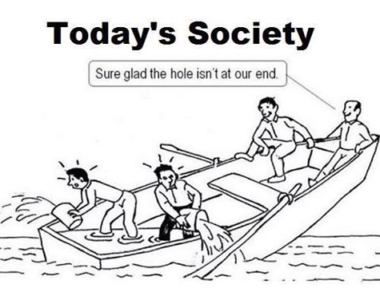

<!-- MarkdownTOC -->

- [Economy. Miscellaneous](#economy-miscellaneous)
	- [IT](#it)
	- [Referencias](#referencias)
	- [Business process improvement](#business-process-improvement)

<!-- /MarkdownTOC -->

<blockquote class="twitter-tweet tw-align-center" data-lang="es">
<a href="https://twitter.com/hashtag/BetterLife?src=hash">#BetterLife</a> Index: Because there’s <a href="https://twitter.com/hashtag/more2life?src=hash">#more2life</a> than cold economic <a href="https://twitter.com/hashtag/stats?src=hash">#stats</a>. Make yr voice heard <a href="https://t.co/wNmW8qAPfq">https://t.co/wNmW8qAPfq</a><a href="https://t.co/M2KP4uIPr0">https://t.co/M2KP4uIPr0</a>
&mdash; OECD (@OECD) <a href="https://twitter.com/OECD/status/770606582858063873">30 de agosto de 2016</a></blockquote>

# Economy. Miscellaneous
- [flowingdata.com: American Immigration history](http://flowingdata.com/2016/01/12/immigration-history/)
- [Real Time Economics twitter.com/WSJecon](https://twitter.com/WSJecon)
- [tradingview.com/widget](https://www.tradingview.com/widget)
- [Why Londoners are worse off than any other British region since 2008](http://www.economist.com/news/britain/21688435-those-living-london-seem-have-fared-well-crisis-fact-their-ludicrously)
- [uk.businessinsider.com: Animated map shows the history of immigration to the US](http://uk.businessinsider.com/animated-map-shows-history-us-immigration-2015-12)
- [Irish biggest losers from financial crash - ECB 🌟](http://www.irishtimes.com/business/economy/irish-biggest-losers-from-financial-crash-ecb-1.2398588)
- [Educated Greeks show highest rate of unemployment in OECD](http://www.ekathimerini.com/203808/article/ekathimerini/news/educated-greeks-show-highest-rate-of-unemployment-in-oecd)
- [Britain is heading for another 2008 crash: here’s why](http://www.theguardian.com/commentisfree/2015/oct/28/2008-crash-government-economic-growth-budgetary-surplus)
- [How does corruption in Africa really compare to OECD countries? Anti-Fraud & Corruption Law in Africa](http://africanantifraud.com/2016/01/20/circles-of-corruption-how-does-africa-stack-up-against-the-oecd/)
- [The General Theory of Employment, Interest and Money. John Maynard Keynes](https://en.wikipedia.org/wiki/The_General_Theory_of_Employment,_Interest_and_Money)
- [Thomas Piketty’s “Capital”, summarised in four paragraphs](http://www.economist.com/blogs/economist-explains/2014/05/economist-explains)
- [Debt: The First 5000 Years. David Graeber](https://en.wikipedia.org/wiki/Debt:_The_First_5000_Years)
- [The End of Work: The Decline of the Global Labor Force and the Dawn of the Post-Market Era. Jeremy Rifkin](https://en.wikipedia.org/wiki/The_End_of_Work)
- [blogs.wsj.com: Six Years Later, 93% of U.S. Counties Haven’t Recovered From Recession, Study Finds](http://blogs.wsj.com/economics/2016/01/12/six-years-later-93-of-u-s-counties-havent-recovered-from-recession-study-finds/)
- [businessinsider.com: Watch 1,400 US workers learn their jobs are moving to Mexico](http://www.businessinsider.com/carrier-workers-learn-jobs-are-moving-to-mexico-2016-2)

<blockquote class="twitter-tweet tw-align-center" data-lang="es">
Greek youth unemployment reached 60% in May, 2013.  It&#39;s now at 51.9% and has been over 40% since February, 2011. <a href="https://t.co/V6SJRCMU17">pic.twitter.com/V6SJRCMU17</a>
&mdash; The Int&#39;l Spectator (@intlspectator) <a href="https://twitter.com/intlspectator/status/756111023023624193">21 de julio de 2016</a></blockquote>

<blockquote class="twitter-tweet tw-align-center" data-lang="es">
Salidas de flujos de Capital, especialmente Italia y España. <a href="https://twitter.com/hashtag/economia?src=hash">#economia</a> <a href="https://t.co/tBxZfLYQqC">pic.twitter.com/tBxZfLYQqC</a>
&mdash; José Manuel García (@abcTraderClub) <a href="https://twitter.com/abcTraderClub/status/755795127612956672">20 de julio de 2016</a></blockquote>

<blockquote class="twitter-tweet tw-align-center" data-lang="es">
Volkswagen brands  - Audi - Bentley - Bugatti - Ducati - Lamborghini - Porsche - Scania - Seat - Skoda - VW <a href="https://t.co/gSvSQgWd9s">pic.twitter.com/gSvSQgWd9s</a>
&mdash; The Int&#39;l Spectator (@intlspectator) <a href="https://twitter.com/intlspectator/status/768131073595158528">23 de agosto de 2016</a></blockquote>

<blockquote class="twitter-tweet tw-align-center" data-lang="es">
Fiat Chrysler brands  - Alfa Romeo - Chrysler - Dodge - Ferrari - Jeep - Lancia - Maserati - Ram Trucks - SRT - Fiat <a href="https://t.co/PGGkCdUolb">pic.twitter.com/PGGkCdUolb</a>
&mdash; The Int&#39;l Spectator (@intlspectator) <a href="https://twitter.com/intlspectator/status/767806138523881473">22 de agosto de 2016</a></blockquote>

<blockquote class="twitter-tweet tw-align-center" data-lang="es">
China and Italy both had economies of $1.1 trillion in 2000  China&#39;s economy is now six times larger than Italy&#39;s <a href="https://t.co/R1TOEn34Bd">pic.twitter.com/R1TOEn34Bd</a>
&mdash; The Int&#39;l Spectator (@intlspectator) <a href="https://twitter.com/intlspectator/status/768085742329352192">23 de agosto de 2016</a></blockquote>

<blockquote class="twitter-tweet tw-align-center" data-lang="es">
Venezuela, 2016.  GDP growth: -8% Inflation: 720% Fiscal deficit: 17% of GDP Interest rate: 21% Reserves: $1 billion <a href="https://t.co/GqM12IakpQ">pic.twitter.com/GqM12IakpQ</a>
&mdash; The Int&#39;l Spectator (@intlspectator) <a href="https://twitter.com/intlspectator/status/768011444419895296">23 de agosto de 2016</a></blockquote>

<blockquote class="twitter-tweet tw-align-center" data-lang="es">
Walmart&#39;s revenue in 2015, of $485 billion, is larger than the GDP of Iran. <a href="https://t.co/H6MQ9kvpOL">pic.twitter.com/H6MQ9kvpOL</a>
&mdash; The Int&#39;l Spectator (@intlspectator) <a href="https://twitter.com/intlspectator/status/767783557146091520">22 de agosto de 2016</a></blockquote>

<blockquote class="twitter-tweet tw-align-center" data-lang="es">
Billionaires, 2016.  China: 568 US: 535 India: 111 UK: 82 Germany: 82 Russia: 80  (Hurun) <a href="https://t.co/n9Z0C3iC6I">pic.twitter.com/n9Z0C3iC6I</a>
&mdash; The Int&#39;l Spectator (@intlspectator) <a href="https://twitter.com/intlspectator/status/767745799971180544">22 de agosto de 2016</a></blockquote>

<blockquote class="twitter-tweet tw-align-center" data-lang="es">
Size of labour force (million)  1. China: 797.6 2. India: 487.3 3. EU: 228 4. US: 155.4 5. Indonesia: 120 <a href="https://t.co/yiO4RfaWFR">pic.twitter.com/yiO4RfaWFR</a>
&mdash; The Int&#39;l Spectator (@intlspectator) <a href="https://twitter.com/intlspectator/status/767730739622268929">22 de agosto de 2016</a></blockquote>

<blockquote class="twitter-tweet tw-align-center" data-lang="es">
Solar panel prices have fallen by over 80% since 2010, driven mainly by a surge in Chinese production. <a href="https://t.co/eiklyZxfOa">pic.twitter.com/eiklyZxfOa</a>
&mdash; The Int&#39;l Spectator (@intlspectator) <a href="https://twitter.com/intlspectator/status/767398422986883072">21 de agosto de 2016</a></blockquote>

<blockquote class="twitter-tweet tw-align-center" data-lang="es">
Suicides per 100,000 people per year  Korea: 29 India: 21 Russia 19 Japan: 18 US: 12 France: 12 Turkey: 8 UK: 6 Israel: 6 Saudi: 0.4  (WHO)
&mdash; The Int&#39;l Spectator (@intlspectator) <a href="https://twitter.com/intlspectator/status/767088978151342080">20 de agosto de 2016</a></blockquote>

<blockquote class="twitter-tweet tw-align-center" data-lang="es">
Birth rate, 2015  Niger: 7.6 Nigeria: 5.5 Israel: 3.3 Saudi: 3 India: 2.3 US: 1.9 Brazil: 1.8 Russia: 1.8 China: 1.7 Germany: 1.5 Japan: 1.4
&mdash; The Int&#39;l Spectator (@intlspectator) <a href="https://twitter.com/intlspectator/status/767066302011670528">20 de agosto de 2016</a></blockquote>

<blockquote class="twitter-tweet tw-align-center" data-lang="es">
Retirement age for men  Greece: 67 Italy: 66.3 US: 66 Germany: 65.3 France: 65 UK: 65 Japan: 61 China: 60 India: 60 Turkey: 60 Indonesia: 58
&mdash; The Int&#39;l Spectator (@intlspectator) <a href="https://twitter.com/intlspectator/status/767051173480116224">20 de agosto de 2016</a></blockquote>

<blockquote class="twitter-tweet tw-align-center" data-lang="es">
Japan&#39;s economy is same size today as it was in 1993.  China&#39;s economy has grown twenty-fold over same period. <a href="https://t.co/Oxj2xpoYD8">pic.twitter.com/Oxj2xpoYD8</a>
&mdash; The Int&#39;l Spectator (@intlspectator) <a href="https://twitter.com/intlspectator/status/767058832283439104">20 de agosto de 2016</a></blockquote>

<blockquote class="twitter-tweet tw-align-center" data-lang="es">
Share of electricity produced from coal, 2010.  Australia: 76% Israel: 58% US: 46% Germany: 44% UK: 29% Japan: 27% Turkey: 26% Canada: 16%
&mdash; The Int&#39;l Spectator (@intlspectator) <a href="https://twitter.com/intlspectator/status/767005870840360960">20 de agosto de 2016</a></blockquote>

<blockquote class="twitter-tweet tw-align-center" data-lang="es">
France  - Unemployment: 10% - Youth unemployment: 23% - National union crisis - President approval: 14% - Three terror attacks in 18 months
&mdash; The Int&#39;l Spectator (@intlspectator) <a href="https://twitter.com/intlspectator/status/766726602482823168">19 de agosto de 2016</a></blockquote>

<blockquote class="twitter-tweet tw-align-center" data-lang="es">
Military spending ($ billion, 2011 prices)  1990 Germany: 73 USSR: 291 Saudi: 25 China: 19  2014 Germany: 46 Russia: 92 Saudi: 74 China: 191
&mdash; The Int&#39;l Spectator (@intlspectator) <a href="https://twitter.com/intlspectator/status/766711550912569344">19 de agosto de 2016</a></blockquote>

<blockquote class="twitter-tweet tw-align-center" data-lang="es">
GRAPHIC: Countries by leading source of imports, 2013. <a href="https://t.co/ntaoBekMol">pic.twitter.com/ntaoBekMol</a>
&mdash; The Int&#39;l Spectator (@intlspectator) <a href="https://twitter.com/intlspectator/status/766364213556105216">18 de agosto de 2016</a></blockquote>

<blockquote class="twitter-tweet tw-align-center" data-lang="es">
GRAPHIC: European countries by percentage of population killed in WWII. <a href="https://t.co/bXqbv30gZo">pic.twitter.com/bXqbv30gZo</a>
&mdash; The Int&#39;l Spectator (@intlspectator) <a href="https://twitter.com/intlspectator/status/766001864169041920">17 de agosto de 2016</a></blockquote>

<blockquote class="twitter-tweet tw-align-center" data-lang="es">
Countries with least trust in politicians  1. Lebanon 2. Venezuela 3. Paraguay 4. Argentina 5. Brazil 6. Italy 7. Czech Republic  (WEF)
&mdash; The Int&#39;l Spectator (@intlspectator) <a href="https://twitter.com/intlspectator/status/765994159396106240">17 de agosto de 2016</a></blockquote>

<blockquote class="twitter-tweet tw-align-center" data-lang="es">
Companies based in state of Bavaria, Germany:  - Allianz - Adidas - Audi - BMW - Puma - Siemens <a href="https://t.co/KUhwyRfbgw">pic.twitter.com/KUhwyRfbgw</a>
&mdash; The Int&#39;l Spectator (@intlspectator) <a href="https://twitter.com/intlspectator/status/764869455255998464">14 de agosto de 2016</a></blockquote>

<blockquote class="twitter-tweet tw-align-center" data-lang="es">
Companies based in California, USA.  Apple Inc. Alphabet Chevron Disney Intel eBay Facebook Visa HP Netflix <a href="https://t.co/hrHKOGejgH">pic.twitter.com/hrHKOGejgH</a>
&mdash; The Int&#39;l Spectator (@intlspectator) <a href="https://twitter.com/intlspectator/status/764839241117425664">14 de agosto de 2016</a></blockquote>

<blockquote class="twitter-tweet tw-align-center" data-lang="es">
MAP: Most photographed places on earth. <a href="https://t.co/I6kQmSn2tQ">pic.twitter.com/I6kQmSn2tQ</a>
&mdash; The Int&#39;l Spectator (@intlspectator) <a href="https://twitter.com/intlspectator/status/763424722239430656">10 de agosto de 2016</a></blockquote>

<blockquote class="twitter-tweet tw-align-center" data-lang="es">
Toyota made more revenue in 2015, $252 billion, than the governments of Greece, South Africa and Ukraine combined. <a href="https://t.co/iRGzgARgw6">pic.twitter.com/iRGzgARgw6</a>
&mdash; The Int&#39;l Spectator (@intlspectator) <a href="https://twitter.com/intlspectator/status/763404996612206593">10 de agosto de 2016</a></blockquote>

<blockquote class="twitter-tweet tw-align-center" data-lang="es">
People killed by police, annual.  US: 428 France: 5 UK: 4 Germany: 2  ---  Police killed, annual.  US: 50 France: 8 Germany: 6 UK: 4
&mdash; The Int&#39;l Spectator (@intlspectator) <a href="https://twitter.com/intlspectator/status/763110201394237440">9 de agosto de 2016</a></blockquote>

<blockquote class="twitter-tweet tw-align-center" data-lang="es">
Exports as % of GDP, 2014  Germany: 46% Russia: 30% UK: 28% Turkey: 28% India: 23% China: 23% Japan: 16% US: 14% <a href="https://t.co/QD9PB8lWoY">pic.twitter.com/QD9PB8lWoY</a>
&mdash; The Int&#39;l Spectator (@intlspectator) <a href="https://twitter.com/intlspectator/status/763080011100266496">9 de agosto de 2016</a></blockquote>

<blockquote class="twitter-tweet tw-align-center" data-lang="es">
US oil and gas company bankruptcies  2013: 15 2014: 14 2015: 67 <a href="https://t.co/PrcYIjHQR8">pic.twitter.com/PrcYIjHQR8</a>
&mdash; The Int&#39;l Spectator (@intlspectator) <a href="https://twitter.com/intlspectator/status/763057559297064960">9 de agosto de 2016</a></blockquote>

<blockquote class="twitter-tweet tw-align-center" data-lang="es">
Favorable view of China  Pakistan: 82% Russia: 79% Israel: 55% Brazil: 55% France: 50% UK: 45% India: 41% US: 38% Turkey: 18% Japan: 9%  Pew
&mdash; The Int&#39;l Spectator (@intlspectator) <a href="https://twitter.com/intlspectator/status/763042543093227521">9 de agosto de 2016</a></blockquote>

<blockquote class="twitter-tweet tw-align-center" data-lang="es">
Share of global economy  US 1980: 25% 2014: 19.2%  EU 1980: 30.9% 2014: 18.4%  China 1980: 2.2% 2014: 16.6%  India 1980: 2.54% 2014: 6%
&mdash; The Int&#39;l Spectator (@intlspectator) <a href="https://twitter.com/intlspectator/status/763034813280292864">9 de agosto de 2016</a></blockquote>

<blockquote class="twitter-tweet tw-align-center" data-lang="es">
GRAPHIC: Muslims as share of population, perception and reality  (Via The Guardian) <a href="https://t.co/ynoYpPOEen">pic.twitter.com/ynoYpPOEen</a>
&mdash; The Int&#39;l Spectator (@intlspectator) <a href="https://twitter.com/intlspectator/status/761970356047360000">6 de agosto de 2016</a></blockquote>

<blockquote class="twitter-tweet tw-align-center" data-lang="es">
Soldiers. (thousand)  Russia: 798 Turkey: 511 France: 209 Germany: 179 Italy: 175 UK: 155 Greece: 143 Spain: 122 <a href="https://t.co/CY0oWksuh8">pic.twitter.com/CY0oWksuh8</a>
&mdash; The Int&#39;l Spectator (@intlspectator) <a href="https://twitter.com/intlspectator/status/761949996426022914">6 de agosto de 2016</a></blockquote>

<blockquote class="twitter-tweet tw-align-center" data-lang="es">
Agriculture price change over past year  Wheat: -18% Corn: -15% Oat: -28% Rice: -17% Canola: -10% Rubber: -24% <a href="https://t.co/TP2Csxntop">pic.twitter.com/TP2Csxntop</a>
&mdash; The Int&#39;l Spectator (@intlspectator) <a href="https://twitter.com/intlspectator/status/761944960744554496">6 de agosto de 2016</a></blockquote>

<blockquote class="twitter-tweet tw-align-center" data-lang="es">
GRAPHIC: America&#39;s shrinking middle class.  (Pew) <a href="https://t.co/ROSEM66kc3">pic.twitter.com/ROSEM66kc3</a>
&mdash; The Int&#39;l Spectator (@intlspectator) <a href="https://twitter.com/intlspectator/status/761222870252924928">4 de agosto de 2016</a></blockquote>

<blockquote class="twitter-tweet tw-align-center" data-lang="es">
Corporate Tax Rate  US: 39% China: 25% Japan: 33% Germany: 29.6% UK: 20% France: 33.3% Brazil: 34% India: 34.6% Russia: 20% Indonesia: 25%
&mdash; The Int&#39;l Spectator (@intlspectator) <a href="https://twitter.com/intlspectator/status/761215392609996801">4 de agosto de 2016</a></blockquote>

<blockquote class="twitter-tweet tw-align-center" data-lang="es">
Favourable views of Muslims  France: 76% UK: 72% Germany: 69% Spain: 52% Italy: 31% Poland: 30%  (Pew, mid-2015) <a href="https://t.co/tBriFBhraM">pic.twitter.com/tBriFBhraM</a>
&mdash; The Int&#39;l Spectator (@intlspectator) <a href="https://twitter.com/intlspectator/status/761205093295271937">4 de agosto de 2016</a></blockquote>

<blockquote class="twitter-tweet tw-align-center" data-lang="es">
GRAPHIC: World&#39;s most frequent flight paths. <a href="https://t.co/JUeStbxvGf">pic.twitter.com/JUeStbxvGf</a>
&mdash; The Int&#39;l Spectator (@intlspectator) <a href="https://twitter.com/intlspectator/status/760898285355671553">3 de agosto de 2016</a></blockquote>

<blockquote class="twitter-tweet tw-align-center" data-lang="es">
In 1991, the G7 countries made up 50.4% of world GDP.  In 2020, they are projected to make up 29%. <a href="https://t.co/vYqiEboJvP">pic.twitter.com/vYqiEboJvP</a>
&mdash; The Int&#39;l Spectator (@intlspectator) <a href="https://twitter.com/intlspectator/status/760581112817070080">2 de agosto de 2016</a></blockquote>

<blockquote class="twitter-tweet tw-align-center" data-lang="es">
Gulf States GDP growth between 2005-2014.  Qatar: 377% Oman: 156% Saudi: 129% UAE: 122% Kuwait: 115% Iran: 80% <a href="https://t.co/Tej58pAH73">pic.twitter.com/Tej58pAH73</a>
&mdash; The Int&#39;l Spectator (@intlspectator) <a href="https://twitter.com/intlspectator/status/759093758537273344">29 de julio de 2016</a></blockquote>

<blockquote class="twitter-tweet tw-align-center" data-lang="es">
The most expensive cities for expats – and there&#39;s a new one at the top of the ranking <a href="https://t.co/wj8HH6TDy3">https://t.co/wj8HH6TDy3</a> <a href="https://t.co/5motrtZUtY">pic.twitter.com/5motrtZUtY</a>
&mdash; World Economic Forum (@wef) <a href="https://twitter.com/wef/status/770635191492673536">30 de agosto de 2016</a></blockquote>

<blockquote class="twitter-tweet tw-align-center" data-lang="es">
The 9 cheapest <a href="https://twitter.com/hashtag/cities?src=hash">#cities</a> to live in <a href="https://twitter.com/hashtag/Europe?src=hash">#Europe</a> <a href="https://t.co/BHqtSBkHiA">https://t.co/BHqtSBkHiA</a> <a href="https://t.co/biAWnPCLnq">pic.twitter.com/biAWnPCLnq</a>
&mdash; World Economic Forum (@wef) <a href="https://twitter.com/wef/status/770754729546743808">30 de agosto de 2016</a></blockquote>

<blockquote class="twitter-tweet tw-align-center" data-lang="es">
4 maps that will change how you see <a href="https://twitter.com/hashtag/migration?src=hash">#migration</a> in <a href="https://twitter.com/hashtag/Europe?src=hash">#Europe</a> <a href="https://t.co/AUJxuIa1GT">https://t.co/AUJxuIa1GT</a> <a href="https://t.co/Ly48GXNKtE">pic.twitter.com/Ly48GXNKtE</a>
&mdash; World Economic Forum (@wef) <a href="https://twitter.com/wef/status/770613805013401600">30 de agosto de 2016</a></blockquote>

<blockquote class="twitter-tweet tw-align-center" data-lang="es">
In 2014, OECD countries accounted for 54% of global <a href="https://twitter.com/hashtag/tourist?src=hash">#tourist</a> arrivals. Compare your country <a href="https://t.co/t6wrBa0Iwm">https://t.co/t6wrBa0Iwm</a> <a href="https://t.co/i1amSlmvfy">pic.twitter.com/i1amSlmvfy</a>
&mdash; OECD (@OECD) <a href="https://twitter.com/OECD/status/766260983878811648">18 de agosto de 2016</a></blockquote>

## IT
- [IT Jobs Watch, Tracking the IT Job Market](http://www.itjobswatch.co.uk/)
- [zdnet.com: 'It's a graveyard': The software devs leaving Greece for good 🌟🌟](http://www.zdnet.com/article/its-a-graveyard-the-software-devs-leaving-greece-for-good/)
- [These 10 cities have the fastest-growing startup scenes — and neither New York nor Silicon Valley made the cut](http://www.businessinsider.com/us-cities-with-fastest-growing-startup-scenes-2016-1)
- [The Economist. The other side of paradise](http://www.economist.com/news/business/21688390-glamorous-tech-startups-can-be-brutal-places-workers-other-side-paradise) Glamorous tech startups can be brutal places for workers
- [businessinsider.com: The 13 worst things about Silicon Valley](http://www.businessinsider.com/the-dark-side-of-silicon-valley-2016-1)
- [Laid-off IT workers muzzled as H-1B debate heats up](http://www.cio.com/article/3027539/outsourcing/laid-off-it-workers-muzzled-as-h-1b-debate-heats-up.html)

______________________________________________________________________________________________________________________________________

## Referencias 

- [Quince películas para entender la crisis 🌟](http://www.elmundo.es/cultura/2016/01/15/56991002e2704e61348b45cb.html)
	- [Margin Call quotes](http://www.imdb.com/title/tt1615147/quotes)
- [La banca especula con instrumentos semejantes a los usados antes de la crisis](http://www.mundiario.com/articulo/a-fondo/banca-especulando-instrumentos-semejantes-utilizados-antes-crisis/20151031004951048655.html)
- [José María Gay, el economista indignado 🌟](https://youtu.be/cby2vsK8O6k)
- Keiser Report en español:
	- [Una economía de casino (E715)](https://youtu.be/guLunFqJYw4)
	- [Una economía momificada (E718)](https://youtu.be/4wZNfZ5j_Ck)
	- [La destrucción de la clase media (E730)](https://youtu.be/y0HvhKH3YrQ)
	- [¡Compren oro! (E739)](https://youtu.be/Zqt18VH2F5o)
	- [Salarios, lo que baja no vuelve a subir (E754)](https://youtu.be/JHrXPlBpDNc)
	- [Una economía en coma (E760)](https://youtu.be/QC7LyJko7dA)
	- [Economías rentistas condenadas al fracaso (E767)](https://youtu.be/QXtbyGwnZEE)
	- [Esclavos de la deuda (E764)](https://youtu.be/esoMBsfa1M4)
	- [Caos financiero general (E782)](https://youtu.be/7yJEgClYDzU)
	- [La Unión Europea en la cuerda floja (E785)](https://youtu.be/P-XLyWS3Wek)
	- [El engaño de la burbuja inmobiliaria (E788)](https://youtu.be/qNQtcKqULcU)
	- [Las gigantes malvadas hipotecarias (E789)](https://youtu.be/mnErMBHrKPk)
	- [El comienzo del fin del capitalismo (E790)](https://youtu.be/OBNbUk3D2XM) El post-capitalismo
	- [El precariado: una nueva clase social (E791) 🌟](https://youtu.be/8cdPD71jZjM) El fenómeno supera todas la fronteras geográficas
	- [La maldita deuda (E792)](https://youtu.be/M89qDw1p2lQ)
	- [Un mundo de estafas Ponzi (E795)](https://youtu.be/Uv7KhOqiBSA)
	- [Volver a la norma del oro (E796)](https://youtu.be/cnfEC4PF23U)
	- [El caso de Chicago (E797)](https://youtu.be/TlA160S9mdw)
	- [La vertiginosa caída del precio del barril (E805)](https://youtu.be/1EvJr_-zx8g)
	- [Días de rabia (E816)](https://youtu.be/nHSPva8eTC0)
	- [El páramo de los mercados financieros (E817)](https://youtu.be/xaJ8rClIjOs)
	- [Todos a endeudarse! (E818)](https://youtu.be/875-LANXBeg)
	- [Guerra contra la pobreza y políticos marioneta (E823)](https://youtu.be/4CmZaGTEZnc)
	- [El control de la riqueza mundial (E824)](https://youtu.be/FcIL2k0LuyY)
	- [Banqueros centrales, secretarios del Tesoro y otros mentirosos (E825)](https://youtu.be/YPEq8_ygWh8)
	- [El imperio de la deuda y calcetines como garantía (E826)](https://youtu.be/NP_Mh2XNy2w)
	- [El fin del capitalismo (E828)](https://youtu.be/IIcIPz4wpCU)
	- [China: el gigante despierto (E830)](https://youtu.be/k0q_zUO4e1M)
	- [La fiesta de las criptodivisas (E832)](https://youtu.be/8xtmuV18Y04)
	- [Misterio y magia en los mercados financieros (E833)](https://youtu.be/dekXrmppTUg)
	- [La muerte del comercio mundial y sobredosis de heroína (E835)](https://youtu.be/1m_NODT6I8g)
	- [Mentiras, evasivas, disparates, odios y esquizofrenia (E839)](https://youtu.be/yWoeZsZdaxs)
	- [Época de recesiones (E840) 🌟](https://youtu.be/esnj2lfr4zA)
    - [La extinción del universo financiero (E880) 🌟](https://www.youtube.com/watch?v=UWfzb0l1jV4)
- [Una de mates: Media y mediana (sueldos)](https://youtu.be/lynZYPTVelw)
- [El sarcasmo de Niño Becerra con la economía española y su visión sobre la recesión mundial](http://www.bolsamania.com/noticias/economia/el-sarcasmo-de-nino-becerra-con-la-economia-espanola--1029719.html)
- [Economistas frente a la crisis](http://economistasfrentealacrisis.com/)
    - [Crisis generacional. Los jóvenes dejan de buscar empleo en España](http://economistasfrentealacrisis.com/crisis-generacional-los-jovenes-dejan-de-buscar-empleo-en-espana/) 
- [¿Va a estallar Silicon Valley? 🌟](http://www.elmundo.es/tecnologia/2016/01/15/568f99eeca4741b7398b466f.html) "En realidad, me preocupa mucho más que España sufra por la falta de digitalización y de productividad que por su exceso"
- [Desmontando los mitos sobre la inflación y la creación de dinero 🌟](http://eduardogarzon.net/desmontando-los-mitos-sobre-la-inflacion-y-la-creacion-de-dinero/)
- [El gran desajuste: "Las empresas germanas son 16 veces más eficientes que los gigantes tecnológicos americanos generando empleo" 🌟🌟🌟](http://xavierferras.blogspot.com.es/2016/02/el-gran-desajuste.html)
- [Capitalismo clientelista](https://es.wikipedia.org/wiki/Capitalismo_clientelista)
- [“El clientelismo amenaza el futuro económico de España” 🌟](http://www.lavanguardia.com/ciencia/20160207/301978772341/clientelismo-corrupcion-amiguismo-economia-espanola.html)

<blockquote class="twitter-tweet tw-align-center" data-lang="es">
Oh España, ese gran pais. <a href="https://twitter.com/hashtag/ironia?src=hash">#ironia</a> El economista indignado <a href="https://t.co/rPu4HjN6IL">https://t.co/rPu4HjN6IL</a>
&mdash; Sara (@smaab6) <a href="https://twitter.com/smaab6/status/652115252528726017">8 de octubre de 2015</a></blockquote>

<iframe width="560" height="315" src="https://www.youtube.com/embed/lynZYPTVelw" frameborder="0" allowfullscreen class="video"></iframe>

 

<iframe width="560" height="315" src="https://www.youtube.com/embed/_cercosFBq4?rel=0" frameborder="0" allowfullscreen class="video"></iframe>

 

<blockquote class="twitter-tweet tw-align-center" data-lang="es">
Niño Becerra: &#39;¿Por qué la economía tiene que crecer cada año? Seguimos como en los años 60&#39; <a href="https://t.co/ZxkoLx8DaD">https://t.co/ZxkoLx8DaD</a> <a href="https://t.co/Eo8Vawznfd">pic.twitter.com/Eo8Vawznfd</a>
&mdash; Bolsamanía (@bolsamania) <a href="https://twitter.com/bolsamania/status/702253251341766657">febrero 23, 2016</a></blockquote>

<blockquote class="twitter-tweet tw-align-center" data-lang="es">
&quot;La nueva era será la de las corporaciones, la de la tecnología desconocida&quot;, dice <a href="https://twitter.com/sninobecerra">@sninobecerra</a> | <a href="https://t.co/v3CesdR5CZ">https://t.co/v3CesdR5CZ</a>
&mdash; Bolsamanía (@bolsamania) <a href="https://twitter.com/bolsamania/status/702893530407149568">25 de febrero de 2016</a></blockquote>

<blockquote class="twitter-tweet tw-align-center" data-lang="es">
On air ;-) <a href="https://t.co/E8430894wN">https://t.co/E8430894wN</a>
&mdash; Marc Vidal (@marcvidal) <a href="https://twitter.com/marcvidal/status/723904827487621121">23 de abril de 2016</a></blockquote>

<iframe width="560" height="315" src="https://www.youtube.com/embed/videoseries?list=PLhkHcc7EKtBZO8HXDD50QKpCwXz9MC7V5" frameborder="0" allowfullscreen class="video"></iframe>

 
______________________________________________________________________________________________________________________________________

## Business process improvement

- [The Italian Tech Sector Is Getting A Boost From Big U.S. Partners](http://techcrunch.com/2016/02/04/the-italian-tech-sector-is-getting-a-boost-from-big-u-s-partners)
- [OECD: Benefiting from the Next Production Revolution 🌟](http://oecdinsights.org/2016/02/23/benefiting-from-the-next-production-revolution/)

<blockquote class="twitter-tweet tw-align-center" data-lang="es">
<a href="https://twitter.com/hashtag/3D?src=hash">#3D</a> printers, nano, robots, big <a href="https://twitter.com/hashtag/data?src=hash">#data</a>: what r the challenges for the production revolution? <a href="https://t.co/34ZJvfML3O">https://t.co/34ZJvfML3O</a> <a href="https://t.co/NHCgphYXg6">pic.twitter.com/NHCgphYXg6</a>
&mdash; OECD (@OECD) <a href="https://twitter.com/OECD/status/702086166829514752">febrero 23, 2016</a></blockquote>

