# Awesome Tech 

<a href="http://www.formacioitreball.org">

<!-- 
 -->

Application Engineer/Middleware SysAdmin | Automation/DevOps CI/CD | Solutions/Systems Architect | RedHat Solutions | Testing | Linux, Puppet, Ansible, AWS, Web (CloudOps) | Contract & Permanent (no freelance) 

Interested in Infrastructure Automation, JBoss, WebLogic, Ansible, Chef, Puppet, PowerShell, DevOps, Monitoring and Metrics. I live in Barcelona since 2012.

<!-- 
Available for work in Barcelona, Madrid, Bilbao. <strike> Looking for new opportunities across Northern-Western Europe based more on the quality of my work and less whom I know </strike>
-->

|||||
|:---:|:---:|:---:|:---:|

|||||
|:---:|:---:|:---:|:---:|

|||||
|:---:|:---:|:---:|:---:|

Wifi N or AC recommended. [Disable Tracking Protection in Firefox](https://support.mozilla.org/en-US/kb/tracking-protection-pbm), use [Firefox's Disconnect.me basic protection list](http://www.ghacks.net/2015/09/20/firefox-43-tracking-protection-with-blocklist-selection/), and disable browser's antivirus plugin in order to render the embedded tweets

<a href="http://paper.li/tag/redhat">The #redhat Daily</a>

<a href="http://paper.li/tag/aws">The #aws Daily</a>

<a href="http://paper.li/tag/azure">The #azure Daily</a>

<a href="http://paper.li/LinuxSec/1363957787">Top #CloudComputing news</a>

<a href="http://paper.li/LinuxSec/1311793532">#Linux Webserver #Security</a>

<a href="http://paper.li/pllnrds/1305983189">Service Management: ITSM, ITIL, DevOps</a>

**Table of Contents**

1. [High quality tech resources and search engines 🌟🌟🌟](high-quality-tech-resources.md)
	- [Newsfeeds like paper.li and Twitter resources 😀](twitter.md)
	- [Miscellaneous. IT Blogs, Support](it-blogs.md)
2. [Startups, Multinationals and IT Jobs. In-Demand Skills](startups.md)
	- [Leadership Styles Around the World 🌟](leadership_styles_around_world.md)
	- [Barcelona Tech, Startups and Innovation](startups_bcn.md)
	- [Madrid Tech, Startups and Innovation](startups_madrid.md)
	- [Rules for success](rules_for_success.md)
	- [Freelance jobs](freelance_jobs.md)
	- [Motivational videos](motivational_videos.md)
3. [Human Resources 🙈 🙉 🙊](hr.md) Stimulating and provocative!
	- [How to Fire and Onboard](howto_fire_onboard.md)
	- [Culture and Collaboration](culture_collaboration.md)
	- [Office Politics](office_politics.md)
	- [Leadership Blogs](leadership.md)
	- [Interview Preparation Guide](interview_preparation_guide.md)
	- [References and online defamation](references.md)
	- [Recursos Humanos](rrhh.md)
4. [Linux](linux.md)
	- [Red Hat 🌟🌟🌟](redhat.md)
		- [Red Hat Virtualization 🌟🌟](redhatvirt.md)
		- [Red Hat OpenStack](redhat_openstack.md)
		- [Red Hat Cluster](redhatcluster.md)
        - [Red Hat JBoss, WildFly 🌟🌟](jboss.md) 
	- [Linux Commands Examples 🌟](linux-commands-examples.md)
	- [Linux Commands Tweets](linux-commands-tweets.md)
5. [Microsoft](microsoft.md)
6. [WebApp, HTTP/2, e-mail, Middleware, JVM, Video 🌟](webapp.md)
    - [Caching. CDN Content Delivery Network 🌟](caching.md)
    - [Nginx](nginx.md)
    - [F5 Load Balancer](f5lb.md)
	- [Cambios en Java 8](jvm-mem.md)
7. [Security 🌟🌟🌟](security.md)
	- [Next Generation Firewalls (NGFW)](NGFW.md)
	- [HTTPs and HSTS 🌟](https.md)
	- [Security auditing tools](auditing-tools.md)
	- [Security Toolkits and Policies. Penetration Testing](pen_testing.md)
	- [SQL injection 🌟](sql_injection.md)
8. [DevOps and ITIL 🌟🌟🌟](devops-itil.md)
    - [Agile planning. CI/CD, Project Management, Scrum, Kanban, Lean 🌟🌟](agileplanning.md)
	- [Metrics with APM, Backend Server Monitoring and Alarm System. Grafana, Graphite, InfluxDB, Zabbix 🌟](metrics.md)
	- [Elasticsearch, Graylog, Syslog ng](elasticsearch.md)
	- [Continuous Integration Tools. Jenkins, Nexus, Bamboo, Git](jenkins-git.md)
9. [Configuration Management and Orchestration. Microservices 🌟🌟](config-mgmt.md)
	- [Ansible 🌟🌟🌟](ansible.md)
	- [Puppet](puppet.md)
    - [Chef](chef.md)
	- [Docker](docker.md)
10. [Software Development](sw-devel.md)
    - [Sublime Text Editor](sublime.md)
    - [Java](java.md)
	- [Python](python.md)
	- [Static Site Generators 🌟🌟](staticsitegen.md)
11. [QA and Testing 🌟🌟🌟](qa.md)
    - [Application Security Testing. OWASP Open Web Application Security Project 🌟](app_sec_testing.md)
    - [Testing Tools 🌟🌟](qa_tools.md)
    - [Testing Tools, Page 2 🌟🌟](qa_tools2.md)
    - [Performance Testing Tools. JMeter, Webpagetest, Taurus, Gatling](webperftesting.md)
	- [Scalability and Reliability 🌟](scalability.md)
	- [Continuous Integration Tools. Jenkins, Nexus, Bamboo, Git](jenkins-git.md)
12. [Data Science and Big Data](data-science.md)
	- [SQL and Databases](databases.md)
	- [NoSQL and NewSQL. MongoDB 🌟](nosql.md)
	- [Anaconda Analytics](anaconda.md)
	- [Big Bang Data 🌟🌟🌟](bigbangdata.md)
13. [Networking 🌟🌟🌟](networking.md)
    - [Virtual LAN](VLAN.md)
    - [Next Generation Firewalls (NGFW)](NGFW.md)
	- [Network Forensics](nw_forensics.md)
    - [Network Performance](nw_performance.md)
    - [CDN Content Delivery Network](cdn.md)
    - [VoIP](voip.md)
    - [Mobile Core Network & Signaling. Diameter](mobilecore.md)
    - [NGN Next-Generation network. IMS IP Multimedia Subsystem](ims.md)
    - [IPTV Internet Protocol Television](iptv.md)
    - [F5 Load Balancer](f5lb.md)
14. [Servers, Storage and Backup](servers-storage-backup.md)
	- [VMware, VirtualBox](vmware.md)
15. [Cloud](cloud.md)
	- [Amazon Web Services 🌟🌟🌟](aws.md)
16. [Desktop Tools and Presentations](desktop-tools.md)
17. [E-Learning 🌟🌟🌟](e-learning.md)
18. [Economy](economy.md)
    - [Economy Miscellaneous](economy_miscellaneous.md)
    - [Economy Videos](economy-videos.md)
    - [Economics. Napoleon](napoleon.md)
    - [Economics Films](economics_films.md)
    - [Live News](live-news.md)
    - [World Press Photo 🌟🌟🌟🌟](world-press-photo.md)
    - [Quote](mkeiser.md)

|||
|:---:|:---:|

|||
|:---:|:---:|

|||
|:---:|:---:|

|||||
|:---:|:---:|:---:|:---:|

|||||
|:---:|:---:|:---:|:---:|

||||||
|:---:|:---:|:---:|:---:|:---:|

|||||||
|:---:|:---:|:---:|:---:|:---:|:---:|

|  |  |||| |
|:---:|:---:|:---:|:---:|:---:|:---:|

|||||||
|:---:|:---:|:---:|:---:|:---:|:---:|

|||||||
|:---:|:---:|:---:|:---:|:---:|:---:|

|||||||
|:---:|:---:|:---:|:---:|:---:|:---:|

|||||||
|:---:|:---:|:---:|:---:|:---:|:---:|

<!---->
|[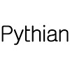](https://www.youtube.com/user/ThePythianGroup)||
|:---:|:---:|

|||
|:---:|:---:|

|||
|:---:|:---:|

||||
|:---:|:---:|:---:|

|||||
|:---:|:---:|:---:|:---:|

|||||
|:---:|:---:|:---:|:---:|

|||||
|:---:|:---:|:---:|:---:|

|||||||
|:---:|:---:|:---:|:---:|:---:|:---:|

|||||||
|:---:|:---:|:---:|:---:|:---:|:---:|

|||||||
|:---:|:---:|:---:|:---:|:---:|:---:|

|||||||
|:---:|:---:|:---:|:---:|:---:|:---:|

|||||||
|:---:|:---:|:---:|:---:|:---:|:---:|

|||||||
|:---:|:---:|:---:|:---:|:---:|:---:|

|||||||
|:---:|:---:|:---:|:---:|:---:|:---:|

|||||||
|:---:|:---:|:---:|:---:|:---:|:---:|

|||||||
|:---:|:---:|:---:|:---:|:---:|:---:|

| || | |  ||
|:---:|:---:|:---:|:---:|:---:|:---:|

||  |  | |||
|:---:|:---:|:---:|:---:|:---:|:---:|

|| |  | | ||
|:---:|:---:|:---:|:---:|:---:|:---:|

|||||||
|:---:|:---:|:---:|:---:|:---:|:---:|

|||||||
|:---:|:---:|:---:|:---:|:---:|:---:|

|||||||
|:---:|:---:|:---:|:---:|:---:|:---:|

||   |  ||||
|:---:|:---:|:---:|:---:|:---:|:---:|

|||||||
|:---:|:---:|:---:|:---:|:---:|:---:|

||| ||||
|:---:|:---:|:---:|:---:|:---:|:---:|

| || | | ||
|:---:|:---:|:---:|:---:|:---:|:---:|

|||||||
|:---:|:---:|:---:|:---:|:---:|:---:|

|||||||
|:---:|:---:|:---:|:---:|:---:|:---:|

|||||||
|:---:|:---:|:---:|:---:|:---:|:---:|

|||||||
|:---:|:---:|:---:|:---:|:---:|:---:|

|||||||
|:---:|:---:|:---:|:---:|:---:|:---:|

|||||||
|:---:|:---:|:---:|:---:|:---:|:---:|

|||||||
|:---:|:---:|:---:|:---:|:---:|:---:|

|||||||
|:---:|:---:|:---:|:---:|:---:|:---:|

|||[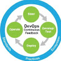](https://www.youtube.com/user/IBMRational)|[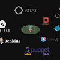](https://www.youtube.com/channel/UCOnioSzUZS-ZqsRnf38V2nA)||
|:---:|:---:|:---:|:---:|:---:|

||||||
|:---:|:---:|:---:|:---:|:---:|

|||||||
|:---:|:---:|:---:|:---:|:---:|:---:|

|||||||
|:---:|:---:|:---:|:---:|:---:|:---:|

|||||||
|:---:|:---:|:---:|:---:|:---:|:---:|

|||||||
|:---:|:---:|:---:|:---:|:---:|:---:|

|||||||
|:---:|:---:|:---:|:---:|:---:|:---:|

|||||||
|:---:|:---:|:---:|:---:|:---:|:---:|

| |  | ||||
|:---:|:---:|:---:|:---:|:---:|:---:|

|||||||
|:---:|:---:|:---:|:---:|:---:|:---:|

|||||||
|:---:|:---:|:---:|:---:|:---:|:---:|

|||||||
|:---:|:---:|:---:|:---:|:---:|:---:|

|||||||
|:---:|:---:|:---:|:---:|:---:|:---:|

|||||||
|:---:|:---:|:---:|:---:|:---:|:---:|

|||||||
|:---:|:---:|:---:|:---:|:---:|:---:|

|| | | | | |
|:---:|:---:|:---:|:---:|:---:|:---:|

||||||
|:---:|:---:|:---:|:---:|:---:|:---:|

|||||||
|:---:|:---:|:---:|:---:|:---:|:---:|

|||||||
|:---:|:---:|:---:|:---:|:---:|:---:|

|||||||
|:---:|:---:|:---:|:---:|:---:|:---:|

|||||||
|:---:|:---:|:---:|:---:|:---:|:---:|

|||||||
|:---:|:---:|:---:|:---:|:---:|:---:|

|||||||
|:---:|:---:|:---:|:---:|:---:|:---:|

<blockquote class="twitter-tweet tw-align-center" data-lang="es">
Science is not perfect. It&#39;s often misused. It&#39;s only a tool. But it&#39;s the best tool we have.
&mdash; Carl Sagan (@drcarlsagan) <a href="https://twitter.com/drcarlsagan/status/341313812357582848">2 de junio de 2013</a></blockquote>

<blockquote class="twitter-tweet tw-align-center" data-lang="es">
Technology is anything invented after you were born. - Alan Kay
&mdash; Tech-FAQ (@tech_faq) <a href="https://twitter.com/tech_faq/status/711841287792504833">21 de marzo de 2016</a></blockquote>

<iframe width="420" height="315" src="https://www.youtube.com/embed/p6xK0Hefsq0?rel=0" frameborder="0" allowfullscreen class="video"></iframe>

 

<iframe width="560" height="315" src="https://www.youtube.com/embed/-vU_HoHZrdc?rel=0" frameborder="0" allowfullscreen class="video"></iframe>

 

<blockquote class="twitter-tweet tw-align-center" data-lang="es">
Esa gente que no para de usar anglicismos. ESA GENTE. Con <a href="https://twitter.com/AntonLofer">@AntonLofer</a> <a href="https://twitter.com/Jamesetes">@Jamesetes</a> <a href="https://twitter.com/jorgeverdu_">@jorgeverdu_</a>  <a href="https://twitter.com/alvaro_moro">@alvaro_moro</a> <a href="https://t.co/wR4BnmERn7">pic.twitter.com/wR4BnmERn7</a>
&mdash; Wasabi Humor (@wasabihumor) <a href="https://twitter.com/wasabihumor/status/756790878451228672">23 de julio de 2016</a></blockquote>

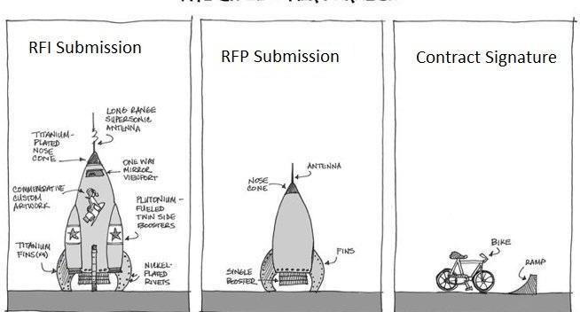

<iframe width="560" height="315" src="https://www.youtube.com/embed/9d500RXYCcA?rel=0" frameborder="0" allowfullscreen class="video"></iframe>

 

<iframe width="560" height="315" src="https://www.youtube.com/embed/7HF1Sfos3v4?list=PL_h5o0KnrCrgB0Xo19U6orpWOv9yxK-c7" frameborder="0" allowfullscreen class="video"></iframe>

 

[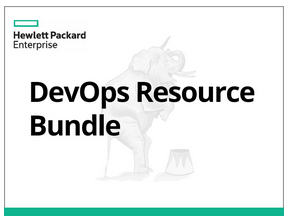](https://dzone.com/whitepapers/hpe-devops-resource-bundle)

<blockquote class="twitter-tweet tw-align-center" data-lang="es">
Automate to save mental energy, not to save time.<a href="https://t.co/JOrpS3X1nr">https://t.co/JOrpS3X1nr</a>
&mdash; Unix tool tip (@UnixToolTip) <a href="https://twitter.com/UnixToolTip/status/818471057313112065">9 de enero de 2017</a></blockquote>

<blockquote class="twitter-tweet tw-align-center" data-lang="es">
‘MAN vs MACHINE’ (for <a href="https://twitter.com/newscientist">@newscientist</a>) - <a href="https://t.co/QkK2VCHBv2">pic.twitter.com/QkK2VCHBv2</a>
&mdash; Tom Gauld (@tomgauld) <a href="https://twitter.com/tomgauld/status/775307640511598606">12 de septiembre de 2016</a></blockquote>

<iframe width="420" height="315" src="https://www.youtube.com/embed/E1o-NWNmQLM?rel=0" frameborder="0" allowfullscreen class="video"></iframe>

 

<iframe width="560" height="315" src="https://www.youtube.com/embed/GWvqkDvv4mE?list=RDGWvqkDvv4mE" frameborder="0" allowfullscreen class="video"></iframe>

 

<blockquote class="twitter-tweet tw-align-center" data-lang="es">
Cleaning out the desk drawer. <a href="https://twitter.com/hashtag/SunMicrosystems?src=hash">#SunMicrosystems</a> I like to think I&#39;ve lived up to this <a href="https://twitter.com/scottmcnealy">@scottmcnealy</a> 10 gr8 yrs 96-06 <a href="https://t.co/efJFnuRTjJ">pic.twitter.com/efJFnuRTjJ</a>
&mdash; Brett Murphy (@PowerMan4Evr) <a href="https://twitter.com/PowerMan4Evr/status/764572168072077312">13 de agosto de 2016</a></blockquote>

<iframe width="560" height="315" src="https://www.youtube.com/embed/3qSSrTx1vjE?list=RD3qSSrTx1vjE" frameborder="0" allowfullscreen class="video"></iframe>

 

<!--
(Dis)Honesty - The Truth About Lies Official Trailer 1 (2015) - Documentary HD 
-->

<iframe width="560" height="315" src="https://www.youtube.com/embed/Ql4tRBlQIoU?rel=0" frameborder="0" allowfullscreen class="video"></iframe>

 

<blockquote class="twitter-tweet tw-align-center" data-lang="es">
Being an IT manager is hard <a href="https://t.co/NtFPyzgCvq">https://t.co/NtFPyzgCvq</a> I&#39;m blessed with good people here. cc <a href="https://twitter.com/khaxan">@khaxan</a>
&mdash; nixCraft # (@nixcraft) <a href="https://twitter.com/nixcraft/status/782938459535052801">3 de octubre de 2016</a></blockquote>

<blockquote class="twitter-tweet tw-align-center" data-lang="es">
Working alone vs. working in a team... that  escalated quickly :( <a href="https://twitter.com/hashtag/Truth?src=hash">#Truth</a> <a href="https://twitter.com/hashtag/Life?src=hash">#Life</a> <a href="https://t.co/DRkmmqpBfZ">pic.twitter.com/DRkmmqpBfZ</a>
&mdash; nixCraft # (@nixcraft) <a href="https://twitter.com/nixcraft/status/789121559428407296">20 de octubre de 2016</a></blockquote>

<blockquote class="twitter-tweet tw-align-center" data-lang="es">
You can&#39;t do everything with money and power; Take Microsoft and Google for example, their calendar systems still can&#39;t sync.
&mdash; Command Line Magic (@climagic) <a href="https://twitter.com/climagic/status/788040464914145285">17 de octubre de 2016</a></blockquote>

[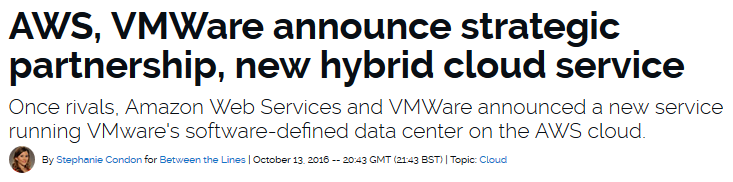](http://www.zdnet.com/article/aws-cements-hybrid-cloud-position-with-vmware-partnership-heres-what-it-means/)

[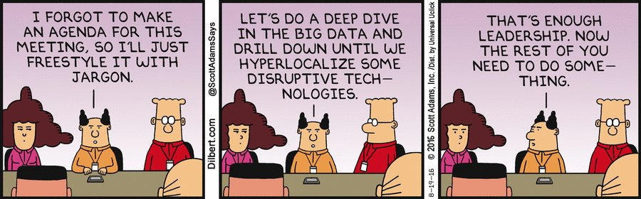](http://dilbert.com/strip/2016-08-19)
<!--
 -->

<iframe width="560" height="315" src="https://www.youtube.com/embed/G6v6rdSYyaA?rel=0" frameborder="0" allowfullscreen class="video"></iframe>

 

[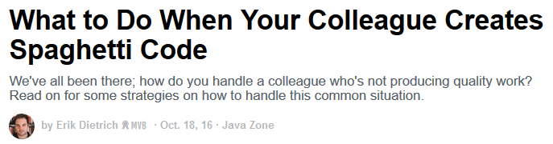](https://dzone.com/articles/what-do-do-when-your-colleague)

[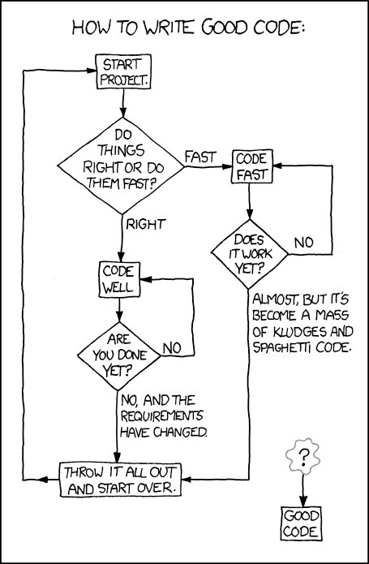](http://awesome-tech.readthedocs.io/devops-itil/)

<iframe width="560" height="315" src="https://www.youtube.com/embed/a3pVqMT9DXA?start=2313&end=2464" frameborder="0" allowfullscreen class="video"></iframe>

 

<a href="http://devopsreactions.tumblr.com/post/139349373443/thinking-of-leaving-the-company-and-get-handed-a">http://devopsreactions.tumblr.com/post/139349373443/thinking-of-leaving-the-company-and-get-handed-a</a>

<iframe width="560" height="315" src="https://www.youtube.com/embed/_Sol6AASguc?rel=0" frameborder="0" allowfullscreen class="video"></iframe>

 

<iframe width="560" height="315" src="https://www.youtube.com/embed/nwoPiEc49is?rel=0" frameborder="0" allowfullscreen class="video"></iframe>

 

<blockquote class="twitter-tweet tw-align-center" data-lang="es">
<a href="https://t.co/VUYG2OPTrw">pic.twitter.com/VUYG2OPTrw</a>
&mdash; Sarah Andersen (@SarahCAndersen) <a href="https://twitter.com/SarahCAndersen/status/748161815679467520">29 de junio de 2016</a></blockquote>

|||
|:---:|:---:|

|||
|:---:|:---:|

<blockquote class="twitter-tweet tw-align-center" data-lang="es">
&quot;Failure is simply the opportunity to begin again, this time more intelligently.&quot; --Henry Ford <a href="https://twitter.com/hashtag/quoteoftheday?src=hash">#quoteoftheday</a>
&mdash; nixCraft (@nixcraft) <a href="https://twitter.com/nixcraft/status/715644488597643264">31 de marzo de 2016</a></blockquote>

<iframe width="560" height="315" src="https://www.youtube.com/embed/WBavpeSScxU?rel=0" frameborder="0" allowfullscreen class="video"></iframe>

 

<blockquote class="twitter-tweet tw-align-center" data-lang="es">
<a href="https://t.co/LOKOX0yXl3">https://t.co/LOKOX0yXl3</a>
&mdash; RedHatSpain (@RedHatSpain) <a href="https://twitter.com/RedHatSpain/status/750384551290167296">5 de julio de 2016</a></blockquote>

<blockquote class="twitter-tweet tw-align-center" data-lang="es">
<a href="https://t.co/jmBeCBREB1">https://t.co/jmBeCBREB1</a>
&mdash; RedHatSpain (@RedHatSpain) <a href="https://twitter.com/RedHatSpain/status/750383381846851584">5 de julio de 2016</a></blockquote>

<blockquote class="twitter-tweet tw-align-center" data-lang="es">
<a href="https://t.co/JHgpqUGw0T">https://t.co/JHgpqUGw0T</a>
&mdash; inafevDevOps (@inafevDevOps) <a href="https://twitter.com/inafevDevOps/status/753692481762492416">14 de julio de 2016</a></blockquote>

<blockquote class="twitter-tweet tw-align-center" data-lang="es">
<a href="https://t.co/nMDlDBiFic">https://t.co/nMDlDBiFic</a>
&mdash; inafevDevOps (@inafevDevOps) <a href="https://twitter.com/inafevDevOps/status/750796644346654720">6 de julio de 2016</a></blockquote>

<blockquote class="twitter-tweet tw-align-center" data-lang="es">
<a href="https://t.co/E3DKzC8bIT">https://t.co/E3DKzC8bIT</a>
&mdash; inafevDevOps (@inafevDevOps) <a href="https://twitter.com/inafevDevOps/status/750797072845209604">6 de julio de 2016</a></blockquote>

[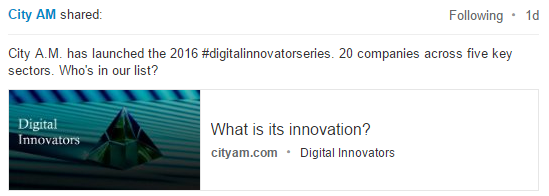](http://www.cityam.com/digital-innovators)

<iframe width="560" height="315" src="https://www.youtube.com/embed/8Cb_CTyquok?rel=0" frameborder="0" allowfullscreen class="video"></iframe>

 

[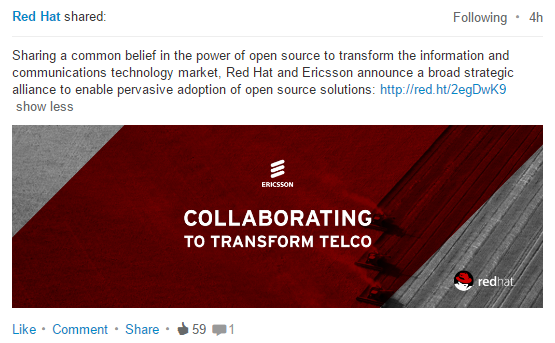](https://www.redhat.com/en/about/press-releases/red-hat-and-ericsson-announce-broad-alliance-enable-pervasive-adoption-open-source-solutions)

<iframe width="560" height="315" src="https://www.youtube-nocookie.com/embed/EHZVxCcN7wU?rel=0" frameborder="0" allowfullscreen class="video"></iframe>

 

<iframe width="560" height="315" src="https://www.youtube.com/embed/rA0NhPJOFyw?rel=0" frameborder="0" allowfullscreen class="video"></iframe>

 

<iframe width="560" height="315" src="https://www.youtube.com/embed/W2yRxSxo8f8?rel=0" frameborder="0" allowfullscreen class="video"></iframe>

 

<iframe width="560" height="315" src="https://www.youtube.com/embed/j7zouWhUTs4?rel=0" frameborder="0" allowfullscreen class="video"></iframe>

 

<iframe width="560" height="315" src="https://www.youtube.com/embed/-4EY8dz4W3o?rel=0" frameborder="0" allowfullscreen class="video"></iframe>

 

<blockquote class="twitter-tweet tw-align-center" data-lang="es">
GDP, 2015. ($ trillion)  Germany: 3.41 UK: 2.85 France: 2.46 Italy: 1.84 Spain: 1.23 Russia: 1.17 Turkey: 0.75 <a href="https://t.co/ltCVGhOtz2">pic.twitter.com/ltCVGhOtz2</a>
&mdash; The Int&#39;l Spectator (@intlspectator) <a href="https://twitter.com/intlspectator/status/750299133852790784">5 de julio de 2016</a></blockquote>

<blockquote class="twitter-tweet tw-align-center" data-lang="es">
GRAPHIC: Countries by leading source of imports, 2013. <a href="https://t.co/ntaoBekMol">pic.twitter.com/ntaoBekMol</a>
&mdash; The Int&#39;l Spectator (@intlspectator) <a href="https://twitter.com/intlspectator/status/766364213556105216">18 de agosto de 2016</a></blockquote>

<iframe src="https://tunein.com/embed/player/s182103/" style="width:100%;height:100px;" scrolling="no" frameborder="no"></iframe>

|||||||
|:---:|:---:|:---:|:---:|:---:|:---:|

<!-- euronews live - 21 oct

<iframe width="560" height="315" src="https://www.youtube.com/embed/o0Y4E4vFw5o?rel=0" frameborder="0" allowfullscreen class="video"></iframe>

  -->

<!--

<iframe width="560" height="315" src="https://www.youtube.com/embed/N7-YxjsHaIs?rel=0" frameborder="0" allowfullscreen class="video"></iframe>

  -->

<iframe width="560" height="315" src="https://www.youtube.com/embed/y60wDzZt8yg?rel=0" frameborder="0" allowfullscreen class="video"></iframe>

 

<iframe width="560" height="315" src="https://www.youtube.com/embed/UdmHHpAsMVw?rel=0" frameborder="0" allowfullscreen class="video"></iframe>

 

<blockquote class="twitter-tweet tw-align-center" data-lang="es">
&quot;El que posee mucho dinero puede especular; el que tiene poco no debe hacerlo; el que está sin blanca se ve obligado a ello&quot; André Kostolany
&mdash; Frases de Trading (@frasesdetrading) <a href="https://twitter.com/frasesdetrading/status/786603758113423361">13 de octubre de 2016</a></blockquote>

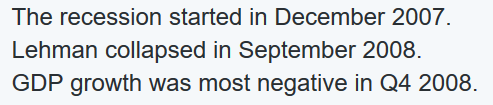

<iframe width="560" height="315" src="https://www.youtube.com/embed/bXEqR7KWlew?rel=0" frameborder="0" allowfullscreen class="video"></iframe>

 

<blockquote class="twitter-tweet tw-align-center" data-lang="es">
I got into this career because I liked computers.  Things have changed.
&mdash; Sad Operator (@sadoperator) <a href="https://twitter.com/sadoperator/status/740265265028464640">7 de junio de 2016</a></blockquote>

<iframe width="560" height="315" src="https://www.youtube.com/embed/PutNITzd4C0?rel=0" frameborder="0" allowfullscreen class="video"></iframe>

 

<blockquote class="twitter-tweet tw-align-center" data-lang="es">
Collective living’s fine for students but for everybody else it stinks | Jonn Elledge <a href="https://t.co/YbOWfk5CaS">https://t.co/YbOWfk5CaS</a>
&mdash; The Guardian (@guardian) <a href="https://twitter.com/guardian/status/725712864581931008">28 de abril de 2016</a></blockquote>

<iframe width="560" height="315" src="https://www.youtube.com/embed/-U3N0L041vw?list=RD-U3N0L041vw&amp;controls=0" frameborder="0" allowfullscreen class="video"></iframe>

 

<iframe width="560" height="315" src="https://www.youtube.com/embed/Jp79HDViQ9s?rel=0" frameborder="0" allowfullscreen class="video"></iframe>

 

[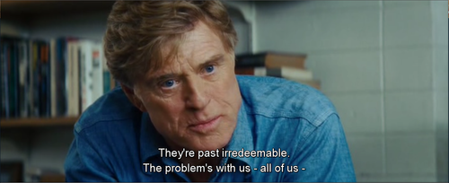](https://www.youtube.com/watch?v=0n02lrQ_5Vo)

<iframe width="560" height="315" src="https://www.youtube.com/embed/4qN-HQlfF5o?rel=0" frameborder="0" allowfullscreen class="video"></iframe>

 

<blockquote class="twitter-tweet tw-align-center" data-lang="es">
<a href="https://twitter.com/hashtag/BetterLife?src=hash">#BetterLife</a> Index: Because there’s <a href="https://twitter.com/hashtag/more2life?src=hash">#more2life</a> than cold economic <a href="https://twitter.com/hashtag/stats?src=hash">#stats</a>. Make yr voice heard <a href="https://t.co/wNmW8qAPfq">https://t.co/wNmW8qAPfq</a><a href="https://t.co/M2KP4uIPr0">https://t.co/M2KP4uIPr0</a>
&mdash; OECD (@OECD) <a href="https://twitter.com/OECD/status/770606582858063873">30 de agosto de 2016</a></blockquote>

<blockquote class="twitter-tweet tw-align-center" data-lang="es">
Una preciosidad. La curva de Phillips en Estados Unidos 1948-2016 <a href="https://t.co/DG8830SN8n">pic.twitter.com/DG8830SN8n</a>
&mdash; Manuel Ale. Hidalgo (@Manuj_Hidalgo) <a href="https://twitter.com/Manuj_Hidalgo/status/787202271532703748">15 de octubre de 2016</a></blockquote>

<iframe width="560" height="315" src="https://www.youtube.com/embed/_LZAJuOTXqg?rel=0" frameborder="0" allowfullscreen class="video"></iframe>

 

<iframe width="560" height="315" src="https://www.youtube.com/embed/jLp-SfowF6I?start=524&end=724" frameborder="0" allowfullscreen class="video"></iframe>

 

<iframe width="560" height="315" src="https://www.youtube.com/embed/mhfrAd_Pa8M?rel=0" frameborder="0" allowfullscreen class="video"></iframe>

 

<blockquote class="twitter-tweet tw-align-center" data-lang="es">
This map tells you everything you need to know about <a href="https://twitter.com/hashtag/innovation?src=hash">#innovation</a> in Europe <a href="https://t.co/pUTR3IyWlo">https://t.co/pUTR3IyWlo</a> <a href="https://t.co/3853yJbBGe">pic.twitter.com/3853yJbBGe</a>
&mdash; World Economic Forum (@wef) <a href="https://twitter.com/wef/status/770916594436476929">31 de agosto de 2016</a></blockquote>

<blockquote class="twitter-tweet tw-align-center" data-lang="es">
The 9 cheapest <a href="https://twitter.com/hashtag/cities?src=hash">#cities</a> to live in <a href="https://twitter.com/hashtag/Europe?src=hash">#Europe</a> <a href="https://t.co/BHqtSBkHiA">https://t.co/BHqtSBkHiA</a> <a href="https://t.co/biAWnPCLnq">pic.twitter.com/biAWnPCLnq</a>
&mdash; World Economic Forum (@wef) <a href="https://twitter.com/wef/status/770754729546743808">30 de agosto de 2016</a></blockquote>

<blockquote class="twitter-tweet tw-align-center" data-lang="es">
Video: Una mejor planeación evita que las ciudades se conviertan en trampas de desigualdad <a href="https://twitter.com/hashtag/BogotaEsLaCumbre?src=hash">#BogotaEsLaCumbre</a> <a href="https://t.co/NvVmx6xxUi">https://t.co/NvVmx6xxUi</a> <a href="https://twitter.com/hashtag/OCDE?src=hash">#OCDE</a>
&mdash; OCDE en Español (@ocdeenespanol) <a href="https://twitter.com/ocdeenespanol/status/786669149355466752">13 de octubre de 2016</a></blockquote>

<blockquote class="twitter-tweet tw-align-center" data-lang="es">
Madrid y Barcelona, en cifras. Comparación en números de servicios públicos<a href="https://t.co/XEQKECFXQ6">https://t.co/XEQKECFXQ6</a>
&mdash; RedHatSpain (@RedHatSpain) <a href="https://twitter.com/RedHatSpain/status/771300150862053376">1 de septiembre de 2016</a></blockquote>

<blockquote class="twitter-tweet tw-align-center" data-lang="es">
ICT specialist? Here’s % of jobs in each OECD country that need yr expertise <a href="https://t.co/clU0hkUeJR">https://t.co/clU0hkUeJR</a> <a href="https://twitter.com/hashtag/digital?src=hash">#digital</a> <a href="https://twitter.com/hashtag/stats?src=hash">#stats</a> <a href="https://t.co/AiaFx1aGHu">pic.twitter.com/AiaFx1aGHu</a>
&mdash; OECD (@OECD) <a href="https://twitter.com/OECD/status/770980988721692673">31 de agosto de 2016</a></blockquote>

<iframe width="560" height="315" src="https://www.youtube.com/embed/oHR-mCBTyZc?rel=0" frameborder="0" allowfullscreen class="video"></iframe>

 

[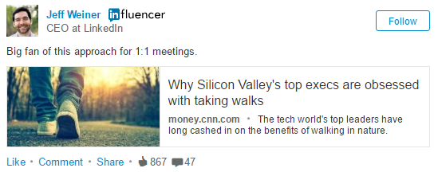](http://money.cnn.com/2016/10/21/technology/silicon-valley-walks/)

<iframe width="560" height="315" src="https://www.youtube.com/embed/hiZ8E956PiU?rel=0" frameborder="0" allowfullscreen class="video"></iframe>

 

[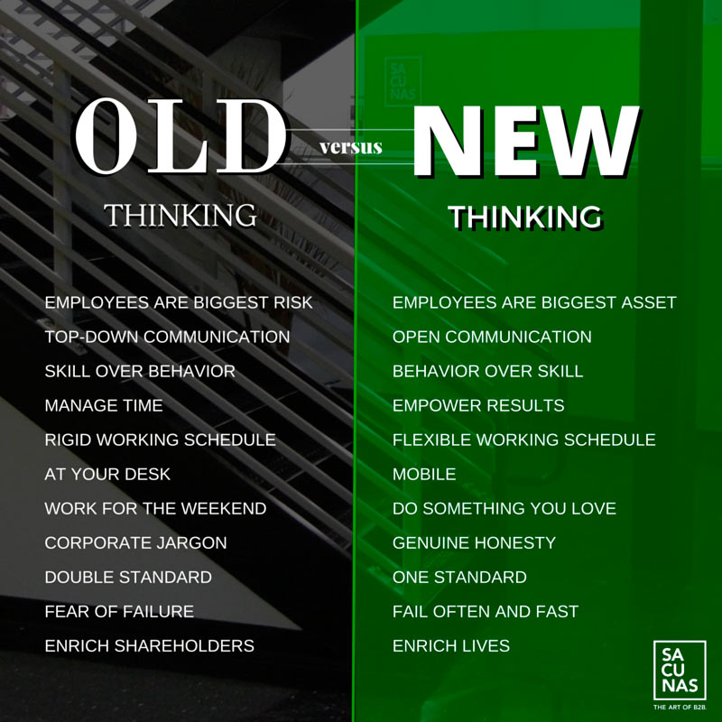](http://plbbusinessconsulting.com/old-thinking-vs-new-thinking/)

<blockquote class="twitter-tweet tw-align-center" data-lang="es">
Curiosity, <a href="https://twitter.com/hashtag/creativity?src=hash">#creativity</a>, critical thinking: Where do job seekers w/<a href="https://twitter.com/hashtag/softskills?src=hash">#softskills</a> have an edge? <a href="https://t.co/dCapgqUWQG">https://t.co/dCapgqUWQG</a> <a href="https://t.co/JS5RxMuJt0">pic.twitter.com/JS5RxMuJt0</a>
&mdash; OECD (@OECD) <a href="https://twitter.com/OECD/status/762759561363222529">8 de agosto de 2016</a></blockquote>

<blockquote class="twitter-tweet tw-align-center" data-lang="es">
Rest up tonight. Arianna Huffington just destroyed that macho &#39;no sleep&#39; mentality. <a href="https://t.co/wAza8hnrGw">pic.twitter.com/wAza8hnrGw</a>
&mdash; Business Insider (@businessinsider) <a href="https://twitter.com/businessinsider/status/786749377138176001">14 de octubre de 2016</a></blockquote>

<blockquote class="twitter-tweet tw-align-center" data-lang="es">
Really proud to work in a company whose CEO believes in Openness and Honesty <a href="https://twitter.com/JWhitehurst">@JWhitehurst</a> <a href="https://twitter.com/hashtag/RedHat?src=hash">#RedHat</a> <a href="https://t.co/XX2EwNmXw6">https://t.co/XX2EwNmXw6</a>
&mdash; Red Hat Iberia (@RedHatIberia) <a href="https://twitter.com/RedHatIberia/status/827607607334547459">3 de febrero de 2017</a></blockquote>

<blockquote class="twitter-tweet tw-align-center" data-lang="es">
&quot;Llull fue un brillante mecánico del arte de la combinatoria&quot;  <a href="https://t.co/EeOXd3b82g">https://t.co/EeOXd3b82g</a> via <a href="https://twitter.com/JotDownSpain">@JotDownSpain</a> <a href="https://twitter.com/hashtag/LlullCCCB?src=hash">#LlullCCCB</a>
&mdash; CCCB (@cececebe) <a href="https://twitter.com/cececebe/status/783554969567956992">5 de octubre de 2016</a></blockquote>

[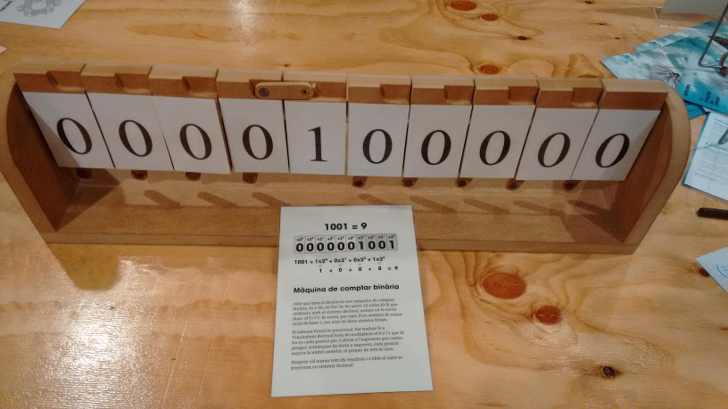](https://twitter.com/search?q=llullcccb)

[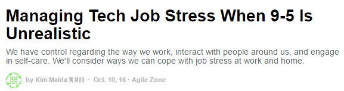](https://dzone.com/articles/managing-tech-job-stress-when-9-5-is-unrealistic)

<iframe width="560" height="315" src='//players.brightcove.net/2097119709001/4kXWOFbfYx_default/index.html?videoId=5147423007001' allowfullscreen frameborder=0 class="video"></iframe>

 

<blockquote class="twitter-tweet tw-align-center" data-lang="es">
Happy <a href="https://twitter.com/hashtag/NationalCoffeeDay?src=hash">#NationalCoffeeDay</a> from Audrey Hepburn in Breakfast at Tiffany&#39;s ☕ <a href="https://t.co/uEJM5EUPpg">pic.twitter.com/uEJM5EUPpg</a>
&mdash; Audrey Hepburn (@SoAudreyHepburn) <a href="https://twitter.com/SoAudreyHepburn/status/781595260749172737">29 de septiembre de 2016</a></blockquote>

<blockquote class="twitter-tweet tw-align-center" data-lang="es">
&quot;Most important, have the courage to follow your heart and intuition.&quot; Remembering Steve and the many ways he changed our world. <a href="https://t.co/ONAuEoq3uU">pic.twitter.com/ONAuEoq3uU</a>
&mdash; Tim Cook (@tim_cook) <a href="https://twitter.com/tim_cook/status/783662822819401728">5 de octubre de 2016</a></blockquote>

<blockquote class="twitter-tweet tw-align-center" data-lang="es">
Working in IT <a href="https://t.co/si5gm0FunB">https://t.co/si5gm0FunB</a>
&mdash; nixCraft (@nixcraft) <a href="https://twitter.com/nixcraft/status/714901664390455296">29 de marzo de 2016</a></blockquote>

<iframe width="560" height="315" src='//players.brightcove.net/2097119709001/4kXWOFbfYx_default/index.html?videoId=5155389588001' allowfullscreen frameborder=0 class="video"></iframe>

 

<blockquote class="twitter-tweet tw-align-center" data-lang="es">
47 years ago today Neil, Mike &amp; I took a ride on a big rocket to the moon.  Liftoff on <a href="https://twitter.com/hashtag/Apollo11?src=hash">#Apollo11</a> <a href="https://t.co/FrvdmddkYo">pic.twitter.com/FrvdmddkYo</a>
&mdash; Buzz Aldrin (@TheRealBuzz) <a href="https://twitter.com/TheRealBuzz/status/754352183836045316">16 de julio de 2016</a></blockquote>

<iframe width="560" height="315" src="https://www.youtube.com/embed/KaOC9danxNo?rel=0" frameborder="0" allowfullscreen class="video"></iframe>

 

<blockquote class="twitter-tweet tw-align-center" data-lang="es">
US and China high-technology exports ($ billion)  1992 US:104 China: 4.3  2012 US: 148  China: 505 <a href="https://t.co/Q5aRVYlSM9">pic.twitter.com/Q5aRVYlSM9</a>
&mdash; The Int&#39;l Spectator (@intlspectator) <a href="https://twitter.com/intlspectator/status/761253033195937793">4 de agosto de 2016</a></blockquote>

<iframe src="//www.slideshare.net/slideshow/embed_code/key/3ydHqSOswtuZqC" width="595" height="335" frameborder="0" marginwidth="0" marginheight="0" scrolling="no" style="border:1px solid #CCC; border-width:1px; margin-bottom:5px; max-width: 100%;" allowfullscreen class="video"> </iframe> 
 <strong> <a href="//www.slideshare.net/LinkedInPulse/gregg-ward-politics-conversations-work-leadership" title="How to Handle Political Conversations at Work" target="_blank">How to Handle Political Conversations at Work</a> </strong> from <strong><a target="_blank" href="//www.slideshare.net/LinkedInPulse">LinkedIn Pulse</a></strong> 

 

<blockquote class="twitter-tweet tw-align-center" data-lang="es">
¿Os parece El gran Gatsby, de Scott Fitzgerald, la mejor novela estadounidense del siglo XX? Enrique Turpin no duda <a href="https://t.co/FpmaEgliTD">https://t.co/FpmaEgliTD</a>
&mdash; Zenda (@zendalibros) <a href="https://twitter.com/zendalibros/status/788999999053062144">20 de octubre de 2016</a></blockquote>

<!-- <iframe width="100%" height="45" src="https://www.youtube.com/embed/uuvDToxhZO0?rel=0&amp;autohide=2&amp;showinfo=0&amp;autoplay=1&amp;controls=2&amp;start=33&amp;end=82" frameborder="0" allowfullscreen></iframe> -->

<iframe width="560" height="315" src="https://www.youtube.com/embed/DtbeVa6PH58?rel=0" frameborder="0" allowfullscreen class="video"></iframe>

 

<iframe width="560" height="315" src="https://www.youtube.com/embed/UWfzb0l1jV4?start=528" frameborder="0" allowfullscreen class="video"></iframe>

 

<iframe width="560" height="315" src="https://www.youtube.com/embed/E5G31VO1c0U" frameborder="0" allowfullscreen class="video"></iframe>

 

<iframe width="560" height="315" src="https://www.youtube.com/embed/-c5P2CvBTRg?list=PLk1Rzj8ppcXm7jv58Hrr6jv1t8A-OHVfA" frameborder="0" allowfullscreen class="video"></iframe>

 

<iframe width="560" height="315" src="https://www.youtube.com/embed/AYbtSpB8pPE?start=633&end=654" frameborder="0" allowfullscreen class="video"></iframe>

 
