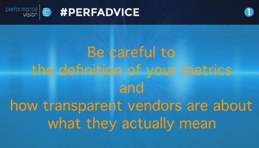

<!-- MarkdownTOC -->

- [Network Performance](#network-performance)
    - [aaNPM tools](#aanpm-tools)
    - [Network Performance Monitoring](#network-performance-monitoring)
        - [ntop](#ntop)
        - [Solarwinds](#solarwinds)
        - [NetCrunch](#netcrunch)
        - [PRTG](#prtg)

<!-- /MarkdownTOC -->

# Network Performance
- [infoworld.com: 10 tips for boosting network performance 🌟](http://www.infoworld.com/article/2627174/network-monitoring/10-tips-for-boosting-network-performance.html)
- [Corvil.com Network Data Analsysis. Free eBook: Understanding Packet Loss](http://corvil.com/resources/white-papers/ebook-understanding-packet-loss)
- [What’s the performance meaning of 0-Windows?](http://blog.securactive.net/performance-meaning-0-windows/) When a machine starts to send more and more 0-win you have to investigate if there is enough resources, CPU, RAM …
- [Great explanation on how performance metrics are calculated by Tony Fortunato (Tech firm)](http://www.lovemytool.com/blog/2015/10/application-performance-term-connect-time-by-tony-fortunato.html)
- [blog.performancevision.com - NETWORK PERFORMANCE: LINKS BETWEEN LATENCY, THROUGHPUT AND PACKET LOSS 🌟🌟🌟](http://blog.performancevision.com/links-between-latency-throughput-and-packet-loss)
- [blog.datapath.io: What is Network Throughput? 🌟🌟](http://blog.datapath.io/what-is-network-throughput)
- [blog.performancevision.com - DNS: KEY TO NETWORK AND APPLICATION PERFORMANCE](http://blog.performancevision.com/dns-key-to-network-and-application-performance)
- [blog.performancevision.com - HOW TO MEASURE NETWORK PERFORMANCE THROUGH PASSIVE TRAFFIC ANALYSIS](http://blog.performancevision.com/how-to-measure-network-performance-through-passive-traffic-analysis)
- [Datapath.io: What is Bandwidth?](http://blog.datapath.io/what-is-bandwidth)
- [Datapath.io: What is Network Congestion?](http://blog.datapath.io/what-is-network-congestion)
- [blog.performancevision.com - 6 REASONS TO TAKE A NEW APPROACH TO PACKET CAPTURE 🌟🌟🌟](http://blog.performancevision.com/the-6-reasons-packet-capture-will-not-work-anymore)
- [AWS Network Performance Optimization Whitepaper 🌟](http://resources.datapath.io/whitepapers/aws-network-performance-optimization-whitepaper) Learn how to minimize Network latency, Packet loss, transit cost and Optimize Bandwidth from AWS to your end users.
- [blog.performancevision.com: Key differences between packet capture and real time stream analysis](http://blog.performancevision.com/key-differences-between-packet-capture-and-real-time-stream-analysis)
- [blog.performancevision.com: HOW TO MAKE A BETTER USE OF YOUR NETWORK SNIFFER](http://blog.performancevision.com/eng/earl/how-to-make-a-better-use-of-your-network-sniffer)
- [HOW TO CAPTURE TRAFFIC WITH VMWARE VDS AND PERFORMANCEVISION](http://blog.performancevision.com/eng/clos/how-to-capture-traffic-with-vmware-vds-and-performancevision) Leverage VMware's native capabilities to process packet capture in a virtual data center
- [Dynamic Web Accelerator for AWS Hosted Applications](http://blog.datapath.io/dynamic-web-accelerator-for-aws-hosted-applications)
- [blog.datapath.io: Understanding Application Delivery Networks](http://blog.datapath.io/understanding-application-delivery-networks)
- [blog.datapath.io: How do you Measure Network Latency Improvements?](http://blog.datapath.io/how-do-you-measure-network-latency-improvements)
- [blog.datapath.io: 4 Ways to Reduce Internet Latency](http://blog.datapath.io/4-ways-to-reduce-internet-latency)
- [blog.performancevision.com: TTFB (TIME TO FIRST BYTE) - A METRIC TO USE WITH PRECAUTION](http://blog.performancevision.com/eng/cons/ttfb-time-to-first-byte-a-metric-to-use-with-precaution)
- [netcraftsmen.com - NETWORK MONITORING: TOP PERFORMANCE ITEMS TO WATCH, PART 1](http://www.netcraftsmen.com/network-monitoring-top-performance-items-watch-part-1/) What’s eating your network? What is (quietly) killing performance? What performance items should you be watching, but probably are not?
- [blog.performancevision.com: WHY IS RETENTION TIME CRITICAL TO PERFORMANCE TROUBLESHOOTING?](http://blog.performancevision.com/why-is-retention-time-critical-to-performance-troubleshooting) Capturing network traffic to get performance analytics is the first step for troubleshooting operations. The second step is to store the information you need and to make that data available over time. Depending on your environment, business context, organization and budget constraint, you may want to retain that data for a shorter or longer period. 
- [blog.performancevision.com: HOW TO LEVERAGE A FLOW MATRIX FOR NETWORK MONITORING](http://blog.performancevision.com/how-to-leverage-a-flow-matrix-for-network-monitoring)
- [blog.datapath.io: Monitoring Network Latency with Datapath.io](http://blog.datapath.io/monitoring-network-latency-with-datapath.io)
- [blog.datapath.io: 8 Network Optimization Principles for DevOps](http://blog.datapath.io/network-optimization-principles-for-devops)
- [blog.performancevision.com: TROUBLESHOOTING SLOW APPLICATIONS: WHY IS THE NETWORK ALWAYS FIRST TO BE BLAMED?](http://blog.performancevision.com/troubleshooting-slow-applications-why-is-the-network-always-first-to-be-blamed)
- [blog.datapath.io: 4 Areas Network Latency is Killing your eCommerce Site](http://blog.datapath.io/4-areas-network-latency-is-killing-your-ecommerce-site)
- [blog.datapath.io: Last Mile Access is Affecting your Internet Speed](http://blog.datapath.io/last-mile-access-is-effecting-your-internet-speed)
- [blog.datapath.io: What are the Causes of Packet Loss?](http://blog.datapath.io/causes-of-packet-loss)
- [nordicapis.com: Don’t Underutilize These 5 Amazing HTTP Performance Features 🌟🌟🌟](http://nordicapis.com/dont-underutilize-these-5-amazing-http-performance-features/)
- [blog.datapath.io: 10 Causes of Network Congestion You Should Know About](http://blog.datapath.io/10-causes-of-network-congestion-you-should-know-about)
- [blog.datapath.io: How to Run a Network Latency Test](http://blog.datapath.io/how-to-run-a-network-latency-test)
- [blog.datapath.io: Dynamic Web Accelerator for AWS Hosted Applications](http://blog.datapath.io/dynamic-web-accelerator-for-aws-hosted-applications)
- [blog.performancevision.com: WHY AUTOMATE PACKET ANALYSIS FOR PERFORMANCE TROUBLESHOOTING?](http://blog.performancevision.com/why-automate-packet-analysis-for-performance-troubleshooting)
- [blog.performancevision.com: THE 5 FACTORS WHICH SLOWDOWN DATA TRANSFERS AND HOW TO IDENTIFY THEM](http://blog.performancevision.com/the-5-factors-which-slowdown-data-transfers-and-how-to-identify-them)
- [blog.datapath.io: A Brief Introduction to Network Optimization](http://blog.datapath.io/a-brief-introduction-to-network-optimization)
- [blog.datapath.io: How to Optimize a CDN for Dynamic Content Delivery](http://blog.datapath.io/cdn-optimization-for-dynamic-content-delivery)
- [blog.datapath.io: What is Acceptable VoIP Jitter?](http://blog.datapath.io/what-is-acceptable-voip-jitter)

## aaNPM tools 
- [APM vs aaNPM – Cutting Through the Marketing BS](https://blog.appdynamics.com/apm/apm-vs-aanpm-cutting-marketing-bs/)
- [sys-con media: Network Performance Monitoring with AANPM tools](http://search.sys-con.com/node/3863280) Converged applications and network monitoring tools greatly enhance cross-team communication and collaboration.
- [Four ways to boost IT performance with application-aware network performance monitoring](https://medium.com/@ManageEngine/four-ways-to-boost-it-performance-with-application-aware-network-performance-monitoring-6c1342ae88df#.ibfnsgu80)

<iframe width="560" height="315" src="https://www.youtube.com/embed/B8AgMu6Wr5g?rel=0" frameborder="0" allowfullscreen class="video"></iframe>

 

<blockquote class="twitter-tweet tw-align-center" data-lang="es">
Why reducing <a href="https://twitter.com/hashtag/jitter?src=hash">#jitter</a> can improve your <a href="https://twitter.com/hashtag/data?src=hash">#data</a> transfert and increase your <a href="https://twitter.com/hashtag/WebPerformance?src=hash">#WebPerformance</a>? <a href="https://t.co/CCye30Glvi">https://t.co/CCye30Glvi</a>
&mdash; Datapath.io (@datapath_io) <a href="https://twitter.com/datapath_io/status/748124606293225472">29 de junio de 2016</a></blockquote>

## Network Performance Monitoring
### ntop
- [ntop.org](http://www.ntop.org/)

<iframe width="560" height="315" src="https://www.youtube.com/embed/cs022q4iu4w?rel=0" frameborder="0" allowfullscreen class="video"></iframe>

 

<iframe width="420" height="315" src="https://www.youtube.com/embed/q97_sX5gRCc?rel=0" frameborder="0" allowfullscreen class="video"></iframe>

 

### Solarwinds
- [Solarwinds: Monitoring 101 ebook](https://thwack.solarwinds.com/docs/DOC-187523)
- [Solarwinds: Network Monitoring for Dummies](http://www.solarwinds.com/lp/bandwidth-analyzer-pack-plus-ebook.aspx)

<iframe width="560" height="315" src="https://www.youtube.com/embed/TybbmHcxXek?list=PLE5D25EB7AA76EE4B" frameborder="0" allowfullscreen class="video"></iframe>

 

<iframe width="560" height="315" src="https://www.youtube.com/embed/-8xPLCIuQzE?rel=0" frameborder="0" allowfullscreen class="video"></iframe>

 

### NetCrunch
- [NetCrunch](https://www.adremsoft.com/netcrunch/)

<blockquote class="twitter-tweet tw-align-center" data-lang="es">
NetCrunch 9: simply awesome network monitoring <a href="https://t.co/XqIkKuH912">https://t.co/XqIkKuH912</a> <a href="https://twitter.com/hashtag/SysAdmin?src=hash">#SysAdmin</a> <a href="https://twitter.com/hashtag/BigData?src=hash">#BigData</a> <a href="https://twitter.com/hashtag/CIO?src=hash">#CIO</a> <a href="https://twitter.com/hashtag/CTO?src=hash">#CTO</a> <a href="https://twitter.com/hashtag/DataViz?src=hash">#DataViz</a> <a href="https://twitter.com/hashtag/DevOps?src=hash">#DevOps</a> <a href="https://t.co/CiDQvRHKGj">pic.twitter.com/CiDQvRHKGj</a>
&mdash; AdRem Software (@adremsoftware) <a href="https://twitter.com/adremsoftware/status/734183514904616961">22 de mayo de 2016</a></blockquote>

<iframe width="560" height="315" src="https://www.youtube.com/embed/e5R0hliHHVk?list=PL4350CA1BB4DE458A" frameborder="0" allowfullscreen class="video"></iframe>

 

### PRTG
- [PRTG](https://www.paessler.com/prtg)

<iframe width="560" height="315" src="https://www.youtube.com/embed/IB-n_aRLgKw?list=PLlzpc0FQ9agj7_SWkChqqisv1Sky8ckgU" frameborder="0" allowfullscreen class="video"></iframe>

 